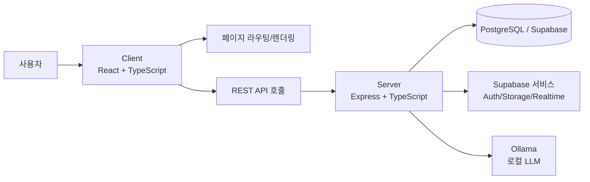

# 이 사이트에 대해

자료 정리, 포트폴리오, 기술 학습을 위한 개인 웹사이트입니다.

## 목적

- **자료 정리**: 학습 내용, 자료, 메모 등을 체계적으로 정리합니다.
- **포트폴리오**: 프로젝트·경험·결과물을 한 곳에 모아 공유합니다.
- **기술 학습**: 풀스택 개발(제작·배포·유지보수)의 전 과정을 실습하고 기록합니다.

## 대상

- 기록을 “나중의 나”가 다시 읽을 수 있게 남기고 싶은 사람
- 작은 기능을 만들며 구조·품질·운영까지 경험해 보고 싶은 사람

## 담는 것 (콘텐츠)

- **포트폴리오**: 작업물과 경력
- **학습 기록**: 개념 정리, 실습 기록, 레퍼런스 요약
- **유용한 링크**: 도구/문서/레퍼런스 아카이브
- **칼럼**: 생각과 에세이(정리된 글)
- **프로젝트**: 사이드 프로젝트 기록

## 기술 스택

| 레이어 | 기술 |
| --- | --- |
| 프론트엔드 | React + TypeScript |
| 백엔드 | Node.js + Express + TypeScript |
| 데이터베이스 | PostgreSQL (Supabase) |
| 인증·기타 | Supabase Auth / Storage / Realtime (필요 시) |

## 프로젝트 구조

```
myLittleWebsite/
├── client/   # 프론트엔드
├── server/   # 백엔드
├── docs/     # 기록(CHANGELOG, decisions, learnings, journal, plans)
└── ...
```

## 아키텍처 다이어그램

```
사용자(브라우저)
  └─ Client (React/TS)
       ├─ 화면: /main, /about, /portfolio, /learning, /links, /column, /project ...
       └─ API 호출
            └─ Server (Express/TS)
                 ├─ DB: PostgreSQL (Supabase)
                 ├─ Auth/Storage/Realtime: Supabase (필요 시)
                 └─ AI(일부 기능): Ollama (로컬 LLM) 호출
```

Mermaid로 표현하면 아래 형태입니다. (현재는 코드블록으로만 표시되며, 렌더링은 추후 옵션입니다.)



## 운영·기록 원칙

- **변경 내역**: 패치노트(CHANGELOG 기반)로 남깁니다.
- **의사결정**: 중요한 구조/기술 선택은 `docs/decisions/`에 기록합니다.
- **학습**: 이해한 개념·동작 방식은 `docs/learnings/`에 정리합니다.

## 바로가기

- [/patch-notes](/patch-notes): 변경 내역
- [/learning](/learning): 학습 기록
- [/links](/links): 유용한 링크
- [/portfolio](/portfolio): 포트폴리오
- [/project](/project): 프로젝트

---

## 부록 A. 디자인 플레이그라운드

폰트, 색상 테마, 컴포넌트 스타일을 **실시간으로 비교**하고 결정을 기록하기 위한 도구입니다.

- [/design-playground](/design-playground): 디자인 플레이그라운드 열기

