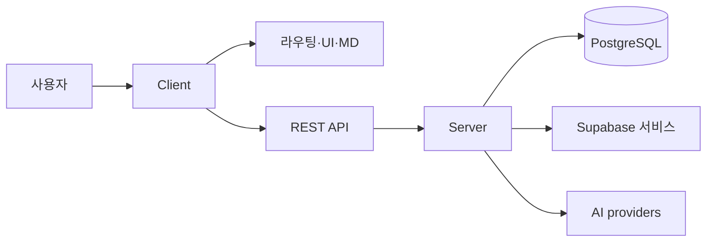
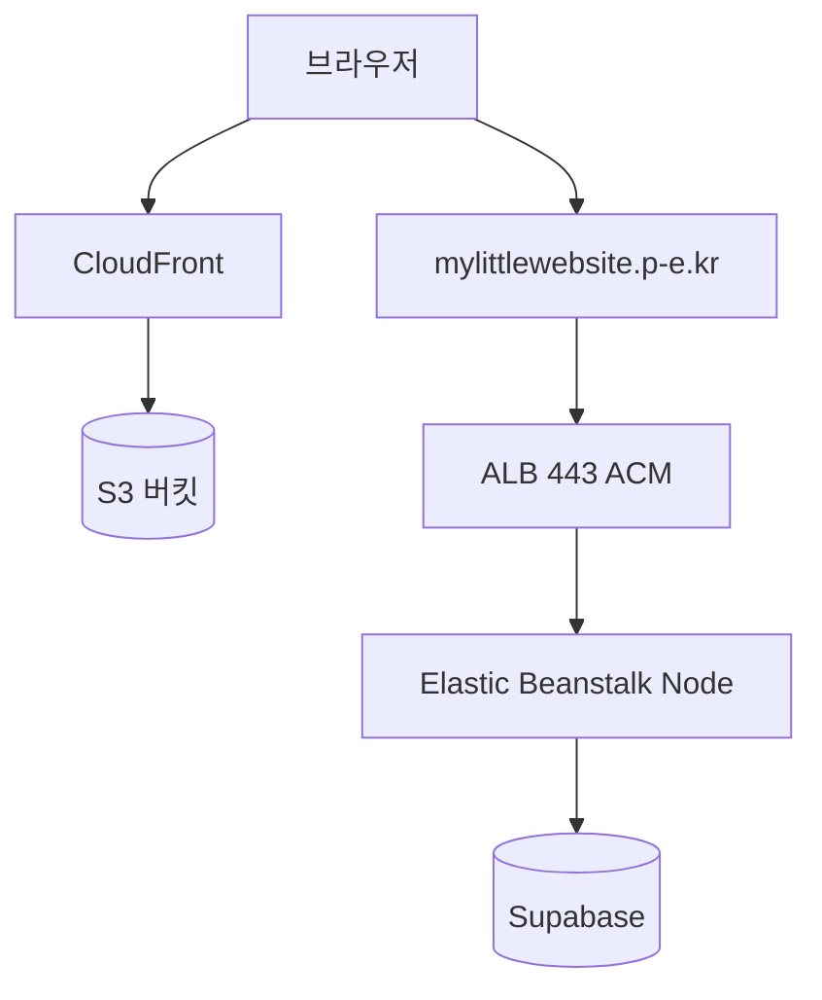

# 이 사이트에 대해

> **한 줄 요약**: 자료 정리, 포트폴리오, 기술 학습을 위해 만들고 **만들면서 기록하는** 개인 웹사이트입니다.  
> **마지막 갱신**: 2026-05-25 (AWS 배포 절 추가)

## 목적

- **자료 정리**: 학습 내용, 자료, 메모를 체계적으로 모읍니다.
- **포트폴리오**: 프로젝트·경험·결과물을 한곳에 공유합니다.
- **기술 학습**: 풀스택(제작·배포·유지보수) 전 과정을 실습하고 남깁니다.

## 이 사이트의 원칙

모든 기능·구조는 아래 세 가지를 따릅니다. (저장소: `.cursor/rules/foundation.mdc`, ADR `docs/decisions/0002-project-foundation.md`)

| 원칙                   | 의미                           | 이 페이지에서의 예                                     |
| ---------------------- | ------------------------------ | ------------------------------------------------------ |
| **Reason-first**       | 추가·변경마다 이유를 남긴다    | 스택·구조 선택은 `docs/decisions/`에 기록              |
| **Self-documentation** | 사이트가 스스로를 설명한다     | 이 문서, [/patch-notes](/patch-notes), About           |
| **Always extensible**  | 나중에 섹션·기능을 붙이기 쉽게 | client/server 분리, FSD 점진 적용, 설정 기반 학습 폴더 |

## 방문자 시나리오

| 보고 싶은 것           | 이동                           |
| ---------------------- | ------------------------------ |
| 작업물·경력            | [/portfolio](/portfolio)       |
| 기술 정리·SQLD 등 학습 | [/learning](/learning)         |
| 모아둔 도구·문서 링크  | [/links](/links)               |
| 글·스크랩(칼럼)        | [/column](/column)             |
| 사이드 프로젝트        | [/project](/project)           |
| AI 개발 도구 스크랩    | [/ai-dev-tools](/ai-dev-tools) |
| 최근 변경              | [/patch-notes](/patch-notes)   |
| 허브(위젯 모음)        | [/main](/main)                 |

## 담는 것 (콘텐츠)

- **포트폴리오**: 작업물과 경력
- **학습 기록**: 개념 정리, 실습, 레퍼런스 (마크다운·Mermaid·수식 지원)
- **유용한 링크**: 도구·문서 아카이브 (일부 AI 자동 분류)
- **칼럼**: 생각·에세이·스크랩
- **프로젝트**: 사이드 프로젝트 기록
- **AI 개발 도구**: 도구 스크랩 검색·목록
- **패치노트**: `CHANGELOG` 기반 **월별** 변경 내역

관리·실험용(일반 방문자 비공개에 가깝게 사용): `/admin`, `/links/admin`, `/login`, `/ai-smoke-test` 등

## 왜 이렇게 만들었는지

요약만 적고, 상세 이유는 저장소의 ADR에 둡니다. (클론 후 `docs/decisions/` 참고. 웹에서는 [/patch-notes](/patch-notes)로 변경 흐름을 볼 수 있습니다.)

| 주제            | 선택                                        | 이유 (한 줄)                           | ADR                                              |
| --------------- | ------------------------------------------- | -------------------------------------- | ------------------------------------------------ |
| 스택            | React+TS, Express, PostgreSQL(Supabase)     | 풀스택 학습·REST·Auth/Storage 통합     | `0001-tech-stack`                                |
| 구조            | `client/` + `server/` + `docs/`             | 역할 분리, 기록을 한곳에               | `0002-project-foundation`                        |
| 프론트 구조     | FSD 점진 적용 (`shared`→`pages`→`widgets`…) | 규모에 맞게 확장, 의존 방향 고정       | `0004-fsd-application-strategy`                  |
| UI              | shadcn + CSS 변수 테마                      | 일관된 컴포넌트·테마 전환              | `0005-design-system-shadcn`, `0008-color-themes` |
| 색 테마         | blue-orange / amber-cyan / **midnight**     | 플레이그라운드에서 고른 메인·서브·다크 | `0007-design-playground-result`                  |
| 학습 폴더       | `public/learnings` + 빌드 시 config         | 마크다운 추가만으로 섹션 확장          | `0010`, `0011`                                   |
| 프로덕션 호스팅 | S3+CloudFront / EB 분리                     | HTTPS·배포 주기·CORS를 명확히          | `0018-aws-production-split-hosting`              |

## 기술 스택

| 레이어       | 기술                                             |
| ------------ | ------------------------------------------------ |
| 프론트엔드   | React + TypeScript + **Vite**                    |
| 백엔드       | Node.js + Express + TypeScript                   |
| 데이터베이스 | PostgreSQL (Supabase)                            |
| 인증·기타    | Supabase Auth / Storage / Realtime (필요 시)     |
| AI (일부)    | Ollama(로컬), Gemini 등 — 기능별 provider 추상화 |

## 프로젝트 구조

```
myLittleWebsite/
├── client/src/
│   ├── app/        # 진입·라우터·프로바이더
│   ├── pages/      # 페이지 단위
│   ├── widgets/    # Header 등 재사용 블록
│   ├── features/   # 사용자 시나리오 (필요 시)
│   ├── entities/   # 도메인 (필요 시)
│   └── shared/     # UI, 설정, 유틸
├── server/src/     # REST API, DB, 비즈니스 로직
├── docs/           # CHANGELOG, decisions, learnings, journal, plans, error-fixes
└── scripts/        # 학습 config 생성 등
```

Supabase·DB 접근은 **server**에서만 합니다. client는 API를 호출합니다.

## 주요 화면 (라우트)

| 경로                                   | 설명                     |
| -------------------------------------- | ------------------------ |
| `/`                                    | 랜딩                     |
| `/main`                                | 메인 허브                |
| `/about`                               | 이 문서                  |
| `/portfolio`                           | 포트폴리오               |
| `/learning`, `/learning/:sectionId/*`  | 학습 목록·문서 읽기      |
| `/links`                               | 유용한 링크              |
| `/column`, `/column/:slug`             | 칼럼·스크랩              |
| `/project`                             | 프로젝트                 |
| `/ai-dev-tools`, `/ai-dev-tools/:slug` | AI 개발 도구             |
| `/patch-notes`                         | 패치노트                 |
| `/skills-intro`                        | UI 스킬 소개 (개발 참고) |
| `/design-playground`                   | 디자인 실험 (부록)       |
| `/admin`, `/links/admin`, `/login`     | 관리                     |

## 아키텍처

```
사용자(브라우저)
  └─ Client (React + Vite + TS)
       ├─ 페이지·마크다운(Mermaid/KaTeX)·테마
       └─ REST API
            └─ Server (Express + TS)
                 ├─ PostgreSQL (Supabase)
                 ├─ Auth / Storage / Realtime (필요 시)
                 └─ AI provider (Ollama, Gemini 등 — 기능별)
```

아래 Mermaid는 About·학습 문서에서 **렌더링**됩니다.



## 프로덕션 배포 (AWS)

**2026-05-16**에 첫 end-to-end 배포에 성공했습니다. 프론트(정적)와 API(Node)는 **호스트·배포 주기가 달라** AWS에서 분리해 두었습니다. (상세 회고: 저장소 `docs/learnings/0034-aws-first-production-deploy-success.md`, ADR `docs/decisions/0018-aws-production-split-hosting.md`)

### 접속 URL (현재)

| 구분        | URL                                       | 비고                                        |
| ----------- | ----------------------------------------- | ------------------------------------------- |
| **프론트**  | https://d4a3hmxzy83r1.cloudfront.net      | S3 + CloudFront(OAC). 예: `/main`           |
| **API**     | https://mylittlewebsite.p-e.kr            | Elastic Beanstalk + ALB **HTTPS**(ACM 서울) |
| **헬스**    | https://mylittlewebsite.p-e.kr/api/health | `{"status":"ok"}` 로 확인                   |
| **DB·Auth** | Supabase                                  | API 서버(EB) 환경 변수로만 연결             |

> **도메인 역할 (현재)**  
> `mylittlewebsite.p-e.kr`(내도메인.한국)은 **API용** CNAME → ALB입니다. 프론트는 아직 CloudFront 기본 도메인(`*.cloudfront.net`)을 씁니다.  
> 루트=사이트·`api.`=API로 나누는 이전 계획: 저장소 `docs/plans/2026-05-19-api-subdomain-migration.md`

### 트래픽 흐름

```text
브라우저 ──HTTPS──► CloudFront ──► S3 (client/dist, learnings/*.md 등 정적)
브라우저 ──HTTPS──► mylittlewebsite.p-e.kr (ALB) ──► EB (Express) ──► Supabase 등
```



### AWS 리소스 (식별자)

| 구분         | 이름·ID                                                                                             |
| ------------ | --------------------------------------------------------------------------------------------------- |
| 리전         | `ap-northeast-2` (서울)                                                                             |
| S3 (프론트)  | `mylittlewebsite-dev-661596276927-ap-northeast-2-an`                                                |
| CloudFront   | 배포 ID `EAV5ODYEOW4VD`                                                                             |
| EB 앱 / 환경 | `MLWserver` / `MLWserver-env`                                                                       |
| CI/CD        | `.github/workflows/deploy-aws.yml`                                                                  |
| AWS 인증     | GitHub Actions **OIDC** → IAM 역할 `github-actions-mylittlewebsite-deploy` (장기 Access Key 미사용) |

### 배포 방법

- **트리거**: `main` 브랜치 push 또는 Actions에서 **workflow_dispatch**
- **프론트**: `client` 빌드(`VITE_API_BASE_URL` 포함) → `aws s3 sync` → (선택) CloudFront **invalidation**
- **API**: `scripts/package-eb-bundle.sh`로 zip → S3 업로드 → EB **애플리케이션 버전** → 환경 배포
- **GitHub Variables**(예): `S3_BUCKET_FRONTEND`, `CLOUDFRONT_DISTRIBUTION_ID`, `VITE_API_BASE_URL`, `EB_*`, `EB_HEALTH_CHECK_URL` — 워크플로 파일 주석과 동일

### 분리 호스팅에서 꼭 맞출 것

| 항목                  | 내용                                                                                                                   |
| --------------------- | ---------------------------------------------------------------------------------------------------------------------- |
| **API URL 빌드**      | `VITE_API_BASE_URL=https://mylittlewebsite.p-e.kr` (끝 `/` 없음). 비우면 개발용 same-origin만 동작                     |
| **CORS**              | EB `CORS_ALLOWED_ORIGINS`에 프론트 출처 `https://d4a3hmxzy83r1.cloudfront.net` 포함                                    |
| **Mixed Content**     | HTTPS 페이지는 **HTTPS API**만 호출 (EB `http://*.elasticbeanstalk.com` 직접 호출 금지)                                |
| **CloudFront 오리진** | Origin path에 `/index.html` 넣지 않음 → `/assets` 404 방지. 루트 문서는 **Default root object** `index.html`           |
| **EB Node**           | `LISTEN_HOST=0.0.0.0`, 헬스 `/api/health`, `PORT`는 플랫폼 값 덮어쓰지 않음                                            |
| **학습 md**           | EB 번들에 learnings 없음 → 목록·트리는 빌드 config + API, 본문 md는 CloudFront `/learnings/` (`docs/error-fixes/0005`) |

### 배포 시 자주 막혔던 점 (요약)

| 증상                        | 해결                                                             |
| --------------------------- | ---------------------------------------------------------------- |
| CloudFront `/assets` 404    | 오리진 Origin path **비움**                                      |
| 메인 위젯 비어 있음         | API HTTPS + `VITE_API_BASE_URL` 재빌드·재배포                    |
| health는 되는데 메인만 실패 | **CORS** 출처 추가 후 EB 재시작                                  |
| EB Degraded, 버전 미반영    | 애플리케이션 버전 → 환경 **배포**, IAM CloudFormation(`awseb-*`) |

상세: 저장소 `docs/error-fixes/0003-aws-eb-cloudfront-cors-deploy.md`

### AWS 관련 문서 (저장소)

| 문서                                                    | 내용                              |
| ------------------------------------------------------- | --------------------------------- |
| `docs/learnings/0034-…`                                 | 첫 프로덕션 배포 회고·체크리스트  |
| `docs/learnings/0025`–`0033`                            | AWS 배포 학습 시리즈              |
| `docs/plans/2026-05-04-aws-first-deploy-walkthrough.md` | 단계별 실습                       |
| `docs/plans/2026-05-19-api-subdomain-migration.md`      | API `api.` + 루트 CloudFront 이전 |
| `docs/error-fixes/0003`, `0005`                         | CORS·EB·학습 프로덕션             |

## 운영·기록

| 종류           | 위치                | 웹에서                       |
| -------------- | ------------------- | ---------------------------- |
| 변경 내역      | `docs/CHANGELOG.md` | [/patch-notes](/patch-notes) |
| 의사결정 (ADR) | `docs/decisions/`   | (저장소)                     |
| 학습 정리      | `docs/learnings/`   | (저장소)                     |
| 개발 일지      | `docs/journal/`     | (저장소)                     |
| 설계·구현 계획 | `docs/plans/`       | (저장소)                     |
| 오류 수정 기록 | `docs/error-fixes/` | (저장소)                     |

## 바로가기

- [/main](/main) — 메인 허브
- [/portfolio](/portfolio) — 포트폴리오
- [/learning](/learning) — 학습 기록
- [/links](/links) — 유용한 링크
- [/column](/column) — 칼럼
- [/project](/project) — 프로젝트
- [/ai-dev-tools](/ai-dev-tools) — AI 개발 도구
- [/patch-notes](/patch-notes) — 패치노트
- [/skills-intro](/skills-intro) — UI 스킬 소개

---

## 부록: 디자인 플레이그라운드

폰트·색상·컴포넌트 스타일을 **실시간으로 비교**하고, 선택 결과를 사이트 테마·컴포넌트에 반영하기 위한 도구입니다. 일반 콘텐츠와 별도로 두었습니다.

- [/design-playground](/design-playground) — 플레이그라운드 열기
- 확정 테마: **blue-orange**(메인), **amber-cyan**(서브), **midnight**(다크)
