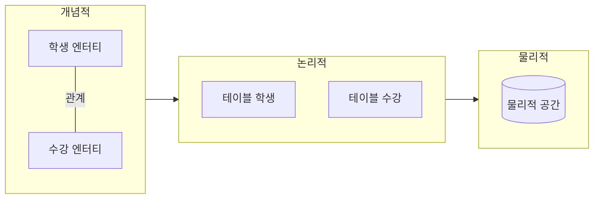

날짜: 2026-05-18
태그: [SQLD, 데이터모델링, ERD, 1과목]
주제: 모델링 정의·특징·관점, 개념·논리·물리 모델링 단계, E-R 구성요소
중요도: 상
---

# 모델링 개념과 데이터베이스 모델링 단계

## 핵심 요약

**모델링**은 현실 세계 정보를 합의된 표기법으로 데이터베이스 구조에 표현하는 과정이다. DB 설계는 **개념적 → 논리적 → 물리적** 순으로 진행하며(암기: **개논물**), 물리 단계로 갈수록 **구체화는 증가**하고 **추상화는 감소**한다. 데이터 모델의 필수 구성요소는 **엔터티(Entity), 속성(Attribute), 관계(Relationship)** 이다.

## 왜 중요한가

- SQLD 1과목 전반의 출발점이며, ERD·정규화·물리 설계 문제의 전제가 된다.
- 「단계별 산출물」「모델링 특징·유의사항」은 단답·객관식으로 자주 출제된다.
- 개념 모델(ERD)과 논리 모델(테이블)의 대응을 그림·표로 설명할 수 있어야 한다.

---

## 1. 데이터 모델링이란

### 정의

- **모델링**: 현실 세계의 정보를 **합의된 표기법**으로 데이터베이스 구조에 표현하는 것

### 모델링의 특징 (암기: **단추명**)

| 특징 | 의미 |
|------|------|
| **단**순화 | 누구나 이해하기 쉽게 표현 |
| **추**상화 | 주요 특징만 간략히 표현 |
| **명**확화 | 모호함을 제거 |

### 모델링 시 유의사항

| 항목 | 의미 |
|------|------|
| **유연성** | 변화에 유연하게 대응할 수 있어야 함 |
| **유일성** | 중복 저장을 피함 |
| **일관성** | 관계가 명확하고 일관되어야 함 |

### 모델링의 세 가지 관점

| 관점 | 초점 |
|------|------|
| **데이터 관점** | 어떤 데이터가 있는가 |
| **프로세스 관점** | 업무 흐름(프로세스) |
| **상관(연관) 관점** | 데이터와 프로세스의 관계 — **CRUD** 분석 기반 |

> **CRUD**: Create(생성), Read(조회), Update(수정), Delete(삭제)

---

## 2. 데이터베이스 모델링 단계

### 흐름

| 단계 | 내용 | 대표 산출물 |
|------|------|-------------|
| **개념적** | 현실에 대한 인식을 **추상적 개념**으로 표현 | **ERD** (E-R 다이어그램) |
| **논리적** | 개념을 **논리적 데이터 구조**로 변환 | 테이블·관계 구조, **정규화** |
| **물리적** | 논리 구조를 **DBMS·저장 매체**에 맞는 물리 구조로 변환 | 실제 스키마, 인덱스, 파티션 등 |

### 단계별 변화

- **개념 → 논리 → 물리**로 갈수록 **구체화 ↑**, **추상화 ↓**

### 논리적 모델링의 핵심

- **정규화**를 통해 재사용성·무결성을 높인다.

---

## 3. 예시: 학생·수강 (개념 → 논리 → 물리)

### 개념적 모델 (E-R 다이어그램)

| 구성 | 예시 |
|------|------|
| **엔터티** | 학생, 수강 |
| **속성 (학생)** | 학번, 생년월일, 이름 |
| **속성 (수강)** | 학번, 과목명, 학점 |
| **관계** | 학생 ↔ 수강 (연결선으로 표현) |

### 논리적 모델 (관계형 테이블)

**학생**

| 학번 | 생년월일 | 이름 |
|------|----------|------|
| 1001 | 1990-01-01 | 홍길동 |
| 1002 | 1991-02-02 | 김철수 |

**수강**

| 학번 | 과목명 | 학점 |
|------|--------|------|
| 1001 | 데이터베이스 | 3 |
| 1001 | 운영체제 | 3 |
| 1002 | 데이터베이스 | 3 |

### 물리적 모델

- 위 논리 구조가 **DBMS가 관리하는 물리적 저장 공간**(디스크·파일·세그먼트 등)에 실제로 구현된 형태

---

## 4. 데이터 모델의 필수 구성요소

| 구성요소 | 설명 |
|----------|------|
| **엔터티 (Entity)** | 현실 세계의 대상·개념 (예: 학생, 수강) |
| **속성 (Attribute)** | 엔터티가 가지는 성질·값 (예: 학번, 이름) |
| **관계 (Relationship)** | 엔터티 간의 연관 |

---

## 5. 시험 포인트 / 함정

| 구분 | 내용 |
|------|------|
| 암기어 | 특징 **단추명**, 단계 **개논물** |
| 단계별 산출물 | 개념 = **ERD**, 논리 = 정규화·테이블, 물리 = DBMS 저장 구조 |
| 방향 | 물리로 갈수록 구체화↑ 추상화↓ (반대로 묻는 함정 주의) |
| 관점 | 상관 관점 ↔ **CRUD** 연결 |
| 구성요소 | Entity, Attribute, Relationship — 3가지 필수 |

---

## 6. 연결 노트

- 이전: (1과목 시작)
- 다음: [02_ERD_표기와_작성순서_ANSI_SPARC](./02_ERD_표기와_작성순서_ANSI_SPARC.md)
