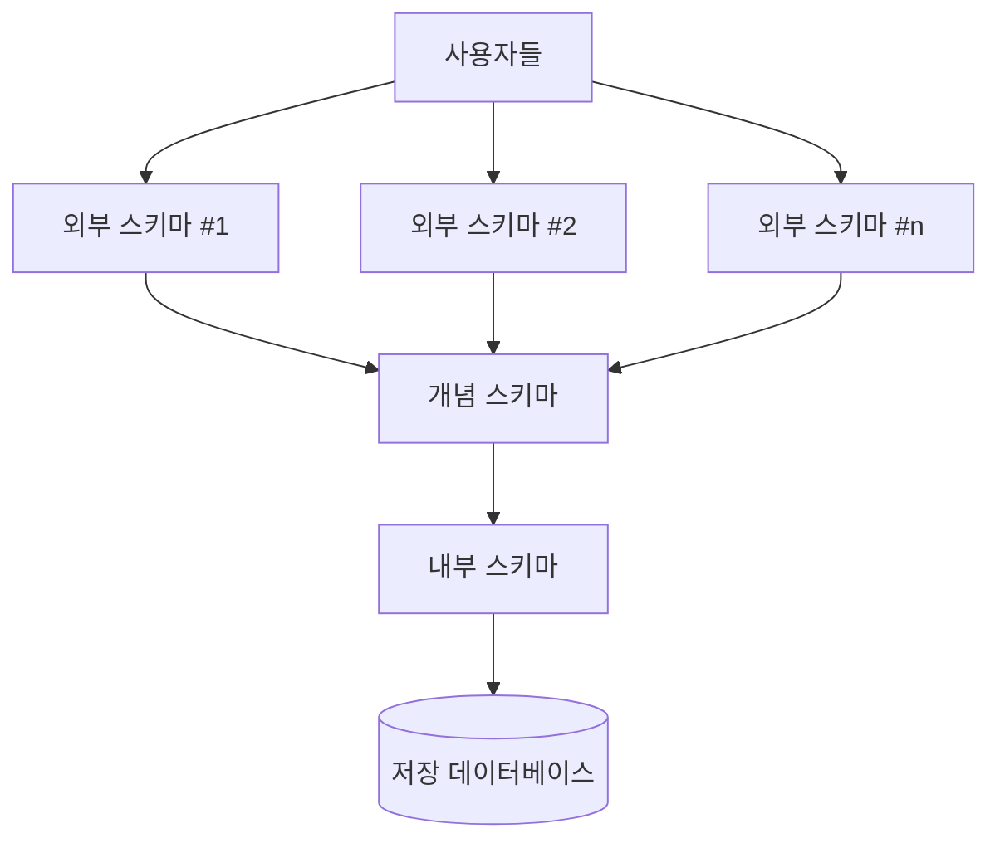

날짜: 2026-05-18
태그: [SQLD, 데이터모델링, ERD, ANSI/SPARC, 1과목]
주제: IE·Barker ERD 표기, ERD 작성 순서, 3단계 스키마·논리·물리 독립성
중요도: 상
---

# ERD 표기법·작성 순서와 ANSI/SPARC 스키마

## 핵심 요약

**ERD**는 Peter Chen이 고안한 엔터티·관계 표기법이며, 시험에서는 **IE 표기법**과 **Barker 표기법** 차이를 구분한다. 작성 순서는 **엔터티 도출 → 배치 → 관계 설정 → 관계명 → 관계 차수 → 필수/선택**(암기: **도배설명차선**)이다. **ANSI/SPARC**는 **외부·개념·내부** 3단계 스키마로 **논리적·물리적 독립성**을 보장한다.

## 왜 중요한가

- ERD 그림 해석·관계 차수·필수/선택 표기는 1과목 빈출 유형이다.
- IE vs Barker 기호(실선/점선, 까마귀발, PK 표기)를 혼동하면 오답이 난다.
- 외부/개념/내부 스키마와 독립성 방향은 객관식·단답형으로 자주 나온다.

---

## 1. ERD 개요

| 항목 | 내용 |
|------|------|
| 의미 | Entity-Relationship Diagram — 개념적 데이터 모델을 시각화 |
| 창시 | **Peter Chen** |
| 대표 표기 | **IE(Information Engineering)**, **Barker** |

---

## 2. IE 표기법 vs Barker 표기법

### 공통 예시 맥락

- **학생**: 학번(PK), 생년월일, 이름
- **수강**: 학번, 과목명, 학점
- 관계: 학생 1 — 수강 N (한 학생이 여러 수강 가능)

### IE(Information Engineering) 표기법

| 요소 | 표현 |
|------|------|
| 엔터티 | **사각형** 박스 |
| 기본키 | 속성 목록 **위쪽**에 구분선으로 분리 (예: 학번) |
| 관계선 | **실선** |
| 차수·선택 | 관계선 끝 기호로 표현 — 학생 쪽 **세로 막대(1)**, 수강 쪽 **까마귀발 + 원(0 또는 다수)** |

→ 위 예: 학생 **1**, 수강 **0..N** (수강이 없을 수도 있음)

### Barker 표기법

| 요소 | 표현 |
|------|------|
| 엔터티 | **모서리가 둥근** 박스 |
| 기본키 | 속성 앞에 **`#`** (예: `#학번`) |
| 관계선 | **점선** — 관계가 **선택(optional)** 임을 나타내는 경우가 많음 |
| 차수 | 수강 쪽 **까마귀발**로 N 쪽 표시 |

### 비교 요약

| 구분 | IE | Barker |
|------|-----|--------|
| 엔터티 모양 | 사각형 | 둥근 사각형 |
| PK 표기 | 상단 구분선 | `#` 접두 |
| 관계선 | 실선(기본) | 점선(선택 관계 등) |
| 시험 포인트 | 막대·까마귀발·원 조합으로 차수·선택 읽기 | `#` = PK, 점선 = optional |

---

## 3. ERD 작성 순서

| 순서 | 단계 | 설명 |
|------|------|------|
| 1 | **엔터티 도출** | 업무에서 핵심 대상(엔터티) 식별 |
| 2 | **배치** | 다이어그램 위에 엔터티 배치 |
| 3 | **관계 설정** | 연관된 엔터티끼리 연결 |
| 4 | **관계명 기술** | 관계의 의미를 이름으로 표기 |
| 5 | **관계 차수 기술** | 1:1, 1:N, M:N 등 |
| 6 | **필수/선택사항 기술** | 관계 참여가 필수인지 선택인지 |

**암기: 도배설명차선** — 도(출)·배(치)·설(정)·명(관계명)·차(수)·선(택)

---

## 4. ANSI/SPARC 3단계 스키마

### 구조 (위 → 아래)

| 레벨 | 다른 이름 | 설명 |
|------|-----------|------|
| **외부 스키마** | 서브스키마, **사용자 뷰** | 특정 사용자·응용이 보는 DB의 일부; **여러 개** 존재 가능 |
| **개념 스키마** | **전체 뷰** | 전체 DB의 논리 구조; 보통 **DBA**가 구축·관리 |
| **내부 스키마** | **저장 스키마** | 디스크 등 **물리 저장** 관점의 구조 |

### 데이터 독립성

| 종류 | 위치(경계) | 의미 |
|------|------------|------|
| **논리적 독립성** | 외부 ↔ 개념 사이 | **개념 스키마**가 바뀌어도 **외부 스키마(사용자 뷰)** 에 영향 없음 |
| **물리적 독립성** | 개념 ↔ 내부 사이 | **내부 스키마(저장 방식)** 가 바뀌어도 **개념·외부** 스키마에 영향 없음 |

> 개념 모델링(ERD) ↔ **개념 스키마**, 물리 모델링 ↔ **내부 스키마**와 연결해 두면 암기가 쉽다.

---

## 5. 시험 포인트 / 함정

| 구분 | 내용 |
|------|------|
| ERD 창시자 | **Peter Chen** |
| 표기 구분 | IE = 사각형·PK 구분선·실선+기호 / Barker = 둥근 박스·`#`·점선 |
| 작성 순서 | **도배설명차선** — 차수(5)와 필수/선택(6) 순서 바꿔 묻기 |
| 외부 스키마 | 「전체 뷰」가 아니라 **사용자별 부분 뷰** |
| 개념 스키마 | **전체 논리 구조**, DBA 관점 |
| 논리적 독립성 | 변경 주체 = **개념** → 외부는 영향 없음 |
| 물리적 독립성 | 변경 주체 = **내부** → 개념·외부 영향 없음 |
| 독립성 방향 | 「외부가 바뀌어도 개념은 안 바뀐다」처럼 **역방향** 함정 주의 |

---

## 6. 연결 노트

- 이전: [01_모델링_개념과_단계](./01_모델링_개념과_단계.md)
- 다음: [03_엔터티_정의와_분류](./03_엔터티_정의와_분류.md)
