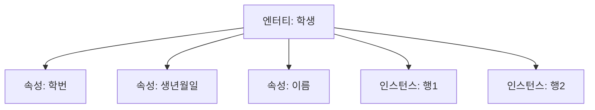
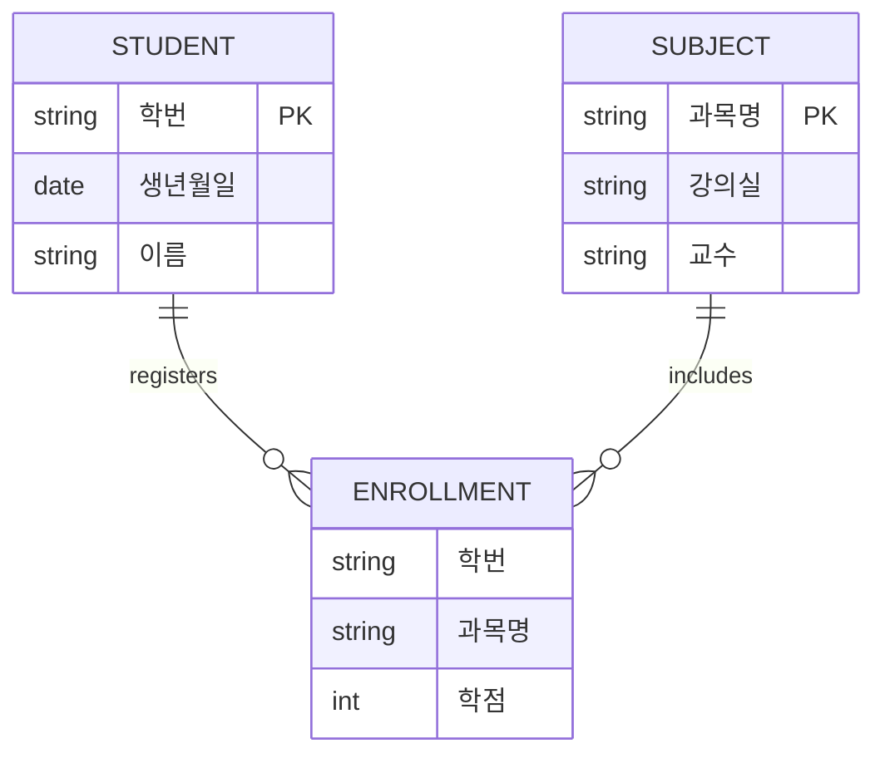

날짜: 2026-05-18
태그: [SQLD, 데이터모델링, 엔터티, ERD, 1과목]
주제: 엔터티 정의·특징·명명법, 인스턴스·속성·식별자, 유형·개념·사건 엔터티
중요도: 상
---

# 엔터티 정의·특징과 분류

## 핵심 요약

**엔터티**는 현실 세계에 존재하며 구별 가능한 객체(학생, 과목, 수강, 고객, 상품, 주문 등)이다. 반드시 **유일한 식별자**가 있고, **인스턴스 2개 이상·속성 2개 이상**이며, **다른 엔터티와 관계**를 가진다. 분류는 **개념·사건·유형** 엔터티(암기: **개사유**)이며, **수강**처럼 두 엔터티를 연결하는 **사건 엔터티**가 M:N을 1:N으로 푸는 데 자주 쓰인다.

## 왜 중요한가

- ERD에서 「이것이 엔터티인가?」 판별과 명명 규칙이 1과목 기본 문항이다.
- 유형/개념/사건 구분은 예시(학생·과목·수강)와 함께 출제된다.
- 인스턴스·속성·속성값·식별자 용어는 테이블·행·열·PK 문제와 직결된다.

---

## 1. 엔터티란

### 정의

- **엔터티(Entity)**: 현실 세계에 존재하며 **명확히 구별**되는 객체
- 예: 학생, 과목, 수강, 고객, 상품, 주문

### 엔터티의 특징 (5가지)

| # | 특징 | 설명 |
|---|------|------|
| 1 | **업무상 필요** | 해당 업무에서 반드시 다뤄야 하는 대상 |
| 2 | **유일한 식별자** | 엔터티 내 인스턴스를 구분하는 식별 수단 존재 |
| 3 | **인스턴스 2개 이상** | 동질의 개체가 둘 이상 존재하는 집합 |
| 4 | **속성 2개 이상** | 설명할 성질이 두 가지 이상 |
| 5 | **관계** | 다른 엔터티와 최소 하나의 관계 |

> 「인스턴스 1개만 있는 것」은 엔터티로 보기 어렵다는 함정 문항에 주의.

### 엔터티 명명법

| 규칙 | 내용 |
|------|------|
| 업무 용어 | 해당 **업무 분야에서 통용**되는 명칭 사용 |
| 약어 금지 | 축약어 사용 지양 |
| 단수 명사 | **단수** 형태 (예: 학생들 X → 학생) |
| 이름 유일 | 서로 다른 엔터티는 **이름이 겹치지 않게** |
| 의미 명확 | 이름만 보고도 **의미가 분명**해야 함 |

---

## 2. 엔터티 구성 요소 (학생 예시)

**\<학생\> 엔터티**를 테이블 형태로 보면:

| 학번 | 생년월일 | 이름 |
|------|----------|------|
| 101 | 1990-01-01 | 홍길동 |
| 102 | 1991-02-02 | 김철수 |
| 104 | 1992-03-03 | 이영희 |

| 용어 | 위치 | 설명 |
|------|------|------|
| **엔터티** | 테이블 전체 | \<학생\>이라는 대상 집합 |
| **속성(Attribute)** | **열(column)** | 학번, 생년월일, 이름 |
| **유일한 식별자** | **학번** | 인스턴스를 구분하는 속성 → 논리 모델에서는 **기본키** |
| **인스턴스(Instance)** | **행(row)** | 101 홍길동, 102 김철수 등 개별 개체 |
| **속성값** | **셀 하나** | 예: 학번 `104` |

---

## 3. 엔터티의 분류

| 분류 | 설명 | 예시 |
|------|------|------|
| **유형 엔터티** | **물리적** 형태가 있음 | 학생, 책, 고객 |
| **개념 엔터티** | 물리 형태는 없으나 **개념적으로** 구별 | 과목, 학과, 부서 |
| **사건 엔터티** | **특정 시점에 일어나는** 업무·행위 | 수강, 주문, 예약 |

**암기: 개사유** — **개**념, **사**건, **유**형

> 순서는 「개념 → 사건 → 유형」이지, 유형·개념·사건 알파벳 순이 아님.

### 사건 엔터티의 역할

- **학생 ↔ 과목**은 보통 M:N
- **수강** 사건 엔터티를 두면 **학생 1 : 수강 N**, **과목 1 : 수강 N**으로 분해 가능

---

## 4. E-R 예시: 학생 · 과목 · 수강

### 엔터티별 속성

| 엔터티 | 분류 | 속성 |
|--------|------|------|
| **학생** | 유형 | 학번(PK), 생년월일, 이름 |
| **과목** | 개념 | 과목명(PK), 강의실, 교수 |
| **수강** | 사건 | 학번, 과목명, 학점 |

### 관계 (IE 표기 기준)

- **학생 1 — 수강 N**: 한 학생이 여러 수강 기록
- **과목 1 — 수강 N**: 한 과목에 여러 학생 수강

> 수강의 학번+과목명은 **복합 식별자** 후보(다음 단원에서 식별 관계와 연결).

---

## 5. 시험 포인트 / 함정

| 구분 | 내용 |
|------|------|
| 엔터티 5조건 | 업무 필요, **유일 식별자**, 인스턴스≥2, 속성≥2, **관계** |
| 명명 | **단수** 명사, 약어 X, 의미·이름 유일 |
| 용어 매핑 | 속성=열, 인스턴스=행, 속성값=셀, 식별자≈PK |
| 분류 암기 | **개사유** (개념·사건·유형) |
| 수강 | **사건 엔터티**, M:N 해소용 |
| 함정 | 「속성 1개만 있어도 엔터티」→ **속성 2개 이상** |
| 함정 | 「인스턴스 1개」→ **2개 이상** 집합 |

---

## 6. 연결 노트

- 이전: [02_ERD_표기와_작성순서_ANSI_SPARC](./02_ERD_표기와_작성순서_ANSI_SPARC.md)
- 다음: [04_엔터티_분류_유무형과_발생시점](./04_엔터티_분류_유무형과_발생시점.md)
