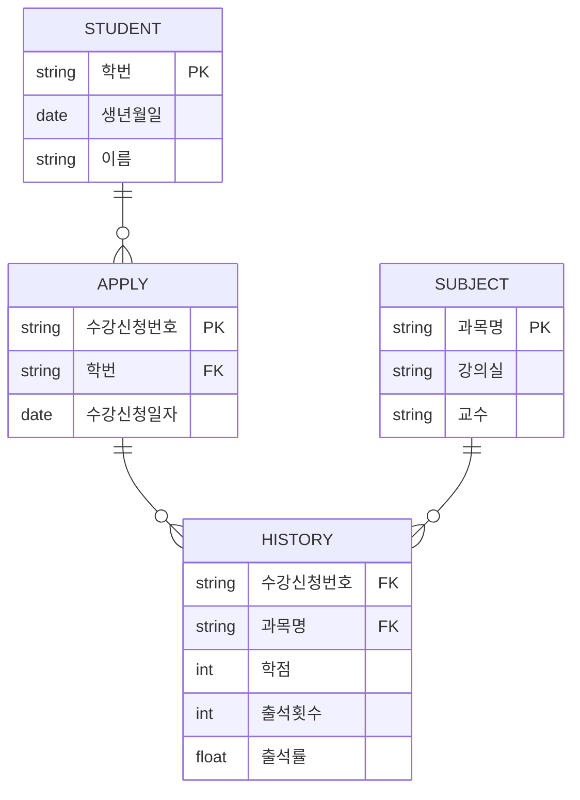

날짜: 2026-05-18
태그: [SQLD, 데이터모델링, 엔터티, ERD, 1과목]
주제: 유무형 분류(유형·개념·사건), 발생 시점 분류(기본·중심·행위), 수강 vs 수강신청·수강내역
중요도: 상
---

# 엔터티 분류 — 유무형과 발생 시점

## 핵심 요약

엔터티 분류는 **기준이 두 가지**다. **유무형** 기준: 유형·개념·**사건**(암기 **개사유**). **발생 시점** 기준: **기본**·**중심**·**행위** — 기본은 독립 존재, 중심은 기본과 행위를 잇고, 행위는 둘 이상 엔터티에서 파생·**갱신이 잦음**. **사건 엔터티(수강)** 와 **행위 엔터티(수강내역)** 는 다른 축이므로 혼동하지 않는다.

## 왜 중요한가

- 같은 「수강」 계열 이름이라도 **사건(유무형)** vs **행위(발생 시점)** 로 묻는 문제가 다르다.
- 수강신청(중심) → 수강내역(행위) 체인 ERD는 관계 차수·엔터티 역할 해석 빈출이다.
- 기본 엔터티「다른 엔터티에 영향받지 않고 독립」정의는 단답형으로 자주 나온다.

> 유무형·정의·명명법 상세: [03_엔터티_정의와_분류](./03_엔터티_정의와_분류.md)

---

## 1. 유무형에 따른 분류 (복습)

| 분류 | 설명 | 예시 |
|------|------|------|
| **유형** | 물리적 형태 있음 | 학생, 책, 고객 |
| **개념** | 물리 형태 없으나 개념적으로 구별 | 과목, 학과, 부서 |
| **사건** | **특정 시점**에 일어나는 일 | 수강, 주문, 예약 |

**암기: 개사유** (개념 · 사건 · 유형)

### E-R 예: 학생 — 수강 — 과목

| 엔터티 | 분류 | 주요 속성 |
|--------|------|-----------|
| 학생 | 유형 | 학번, 생년월일, 이름 |
| **수강** | **사건** | 학번, 과목명, 학점 |
| 과목 | 개념 | 과목명, 강의실, 교수 |

| 관계 | 차수 |
|------|------|
| 학생 — 수강 | **1 : N** |
| 과목 — 수강 | **1 : N** |

→ 학생·과목 M:N을 **사건 엔터티 수강**으로 분해

---

## 2. 발생 시점에 따른 분류

| 분류 | 설명 | 예시 |
|------|------|------|
| **기본 엔터티** | **다른 엔터티에 영향받지 않고** 스스로 존재·식별 | 학생, 과목, 고객, 직원 |
| **중심 엔터티** | **기본** 엔터티와 **행위** 엔터티를 **연결** | 수강신청, 주문 |
| **행위 엔터티** | **둘 이상** 엔터티에서 **파생(상속)** 되며, **갱신이 잦음** | 수강내역, 주문내역 |

### 역할 비교

| 구분 | 기본 | 중심 | 행위 |
|------|------|------|------|
| 독립성 | 높음 (모델의 출발점) | 연결·조정 역할 | 다른 엔터티에 의존 |
| 갱신 빈도 | 상대적으로 낮음 | 중간 | **높음** (출석·학점 등) |
| 예시 키워드 | 학번, 과목명 | 수강신청번호 | 수강내역·주문내역 |

---

## 3. E-R 예: 학생 — 수강신청 — 수강내역 — 과목

| 엔터티 | 발생 시점 분류 | 주요 속성 |
|--------|----------------|-----------|
| 학생 | **기본** | 학번, 생년월일, 이름 |
| **수강신청** | **중심** | 수강신청번호, 학번, 수강신청일자 |
| **수강내역** | **행위** | 수강신청번호, 과목명, 학점, 출석횟수, 출석률 |
| 과목 | **기본** | 과목명, 강의실, 교수 |

### 관계

| 관계 | 차수 |
|------|------|
| 학생 — 수강신청 | **1 : N** |
| 수강신청 — 수강내역 | **1 : N** |
| 과목 — 수강내역 | **1 : N** |

### 업무 흐름으로 읽기

1. **학생**(기본)이 **수강신청**(중심)을 한다.
2. 신청 단위로 **수강내역**(행위)이 생기고, 과목별 학점·출석 등이 **자주 갱신**된다.
3. **과목**(기본)은 여러 수강내역과 연결된다.

---

## 4. 두 분류 기준 한눈에

| 기준 | 분류 | 대표 예 (수강 도메인) |
|------|------|------------------------|
| **유무형** | 유형 / 개념 / **사건** | **수강** (사건) |
| **발생 시점** | **기본** / **중심** / **행위** | **수강내역** (행위), **수강신청** (중심) |

| 이름 | 유무형에서 | 발생 시점에서 |
|------|------------|----------------|
| 수강 | **사건** 엔터티 | (다른 예시 축) |
| 수강신청 | — | **중심** 엔터티 |
| 수강내역 | — | **행위** 엔터티 |
| 학생·과목 | 유형·개념 | **기본** 엔터티 |

---

## 5. 시험 포인트 / 함정

| 구분 | 내용 |
|------|------|
| 분류 축 2개 | **유무형(개사유)** ≠ **발생 시점(기본·중심·행위)** |
| 사건 vs 행위 | **사건** = 시점 이벤트(수강) / **행위** = 파생·갱신 잦음(수강내역) |
| 기본 엔터티 | **독립** 존재, 다른 엔터티에 **영향받지 않음** |
| 중심 엔터티 | 기본 ↔ 행위 **연결** (수강신청, 주문) |
| 행위 엔터티 | **2개 이상** 엔터티에서 파생, **업데이트 빈번** |
| ERD 체인 | 학생 1—N 수강신청 1—N 수강내역, 과목 1—N 수강내역 |
| 함정 | 수강(사건)을 행위 엔터티로 분류 → **오답** |

---

## 6. 연결 노트

- 이전: [03_엔터티_정의와_분류](./03_엔터티_정의와_분류.md)
- 다음: [05_속성_정의와_분류](./05_속성_정의와_분류.md)
