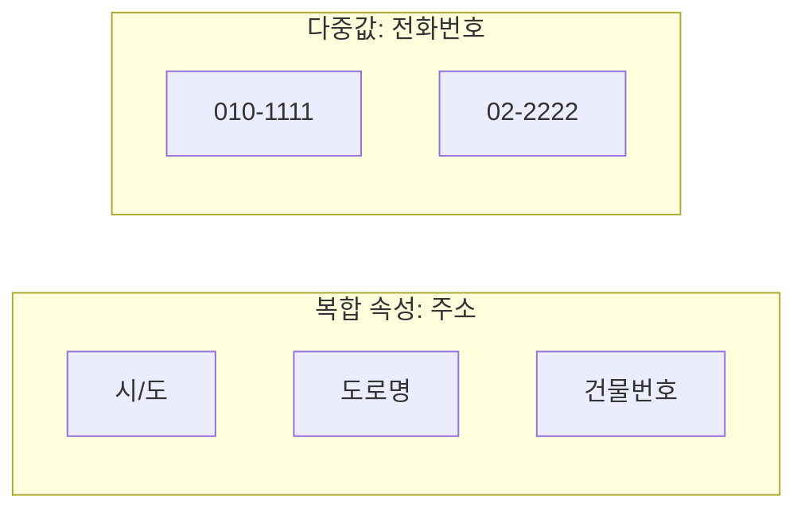

날짜: 2026-05-18
태그: [SQLD, 데이터모델링, 속성, 정규화, 1과목]
주제: 속성 정의·원자성, 함수적 종속, 속성 분류(특성·분해·구성), PK·FK
중요도: 상
---

# 속성 정의·특징과 분류

## 핵심 요약

**속성**은 더 이상 나눌 수 없는 **최소 데이터 단위**이며, 이 성질을 **원자성(Atomicity)** 이라 한다. 엔터티는 속성의 집합이고, 속성 하나에는 **값 하나**, **기본식별자(PK)에 함수적으로 종속**한다. 분류는 **특성**(기본·설계·파생), **분해 가능 여부**(단일·복합·다중값), **구성**(PK·FK·일반) 세 축으로 본다. **자식 엔터티**는 부모의 **PK를 FK로 포함**한다.

## 왜 중요한가

- **1NF(원자성)**, **2NF·3NF(함수적 종속)** 의 출발점이다.
- 복합·다중값 속성은 테이블 설계·정규화 문제로 직결된다.
- 「기본 **속성**」과 「기본 **엔터티**」는 용어가 비슷해 혼동하기 쉽다.

---

## 1. 속성이란

### 정의

- **속성(Attribute)**: 더 이상 **분해할 수 없는** 최소 데이터 단위
- 이 성질 = **원자성(Atomicity)** → 정규화 **1NF**와 연결

### 특징

| # | 특징 | 설명 |
|---|------|------|
| 1 | 엔터티 = 속성의 집합 | 엔터티는 여러 속성으로 설명됨 |
| 2 | 속성당 값 하나 | 한 속성에 **하나의 속성값** |
| 3 | PK에 함수적 종속 | 속성은 **기본 식별자(PK)** 에 **함수적으로 종속** |
| 4 | 업무 정보 | 업무에서 관리하는 정보 단위 |

### 함수적 종속 (Functional Dependency)

- **속성 A → 속성 B**: A 값이 정해지면 B 값이 **유일하게** 결정됨
- 표기: \( A \rightarrow B \)
- 예: 학번 → 이름 (한 학번에 이름 하나)

### 속성 명명법

| 규칙 | 내용 |
|------|------|
| 업무 용어 | 실제 **업무에서 쓰는** 명칭 |
| 서술 지양 | 설명·서술형 표현 피함 |
| 약어 최소화 | 가능하면 **약어 사용 안 함** |
| 이름 유일 | 속성 이름 **중복 없음** |

---

## 2. 특성에 따른 분류

| 분류 | 설명 | 예시 |
|------|------|------|
| **기본 속성** | 엔터티에 **자연스럽게** 존재 | 이름, 학번, 고객번호 |
| **설계 속성** | 시스템·업무 **설계**로 부여 | 주문번호, 일련번호 |
| **파생 속성** | 다른 데이터 **계산·변환** | 합계, 평균, 나이(생년월일 기준) |

> **기본 속성** ≠ **기본 엔터티** — 앞자만 같고 분류 축이 다름.

---

## 3. 분해 가능 여부에 따른 분류

| 분류 | 설명 | 예시 | 설계 시 |
|------|------|------|---------|
| **단일 속성** | 하나의 의미, 더 쪼개지 않음 | 이름, 학번 | 그대로 컬럼 |
| **복합 속성** | **하위 속성**으로 분해 가능 | 주소 → 시/도, 도로명, 건물번호 | 정규화 시 분리 검토 |
| **다중값 속성** | 인스턴스당 **값이 여러 개** | 전화번호, 이메일, 취미 | 보통 **별도 테이블**로 분리 (1NF) |

---

## 4. 구성방식에 따른 분류

| 분류 | 설명 |
|------|------|
| **PK 속성** | 인스턴스를 **유일하게** 식별 |
| **FK 속성** | 관계로 **다른 엔터티**와 연결 |
| **일반 속성** | PK·FK가 **아닌** 나머지 |

### PK · FK 관계 규칙

> **자식 엔터티**는 **부모 엔터티의 PK**를 자신의 **FK**로 포함한다.

| 역할 | 예 (학생 · 수강) |
|------|------------------|
| 부모 | 학생 — PK: 학번 |
| 자식 | 수강 — FK: 학번 (학생 PK 참조) |

---

## 5. 분류 축 한눈에

| 기준 | 분류 |
|------|------|
| **특성** | 기본 · 설계 · **파생** |
| **분해** | 단일 · **복합** · **다중값** |
| **구성** | **PK** · **FK** · 일반 |

---

## 6. 시험 포인트 / 함정

| 구분 | 내용 |
|------|------|
| 원자성 | 더 이상 분해 불가 = **Atomicity** ↔ **1NF** |
| 함수적 종속 | \( A \rightarrow B \): A로 B **유일 결정** |
| 파생 속성 | 합계·평균 — 저장 여부는 설계 선택, 개념 문제에 자주 출제 |
| 다중값 | 전화번호 여러 개 → **별도 테이블** (1NF 위반 방지) |
| 복합 vs 다중값 | 복합 = **의미 단위 분해**(주소), 다중값 = **같은 속성 값 여러 개**(전화) |
| PK·FK | 자식이 부모 **PK를 FK로** 가짐 |
| 용어 함정 | **기본 속성** ≠ **기본 엔터티** |
| 명명 | 서술형·약어 남용 X, **유일한 이름** |

---

## 7. 연결 노트

- 이전: [04_엔터티_분류_유무형과_발생시점](./04_엔터티_분류_유무형과_발생시점.md)
- 다음: [06_도메인과_관계](./06_도메인과_관계.md)
