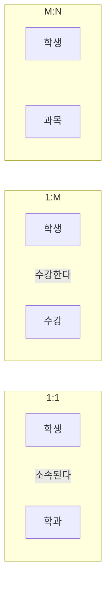

날짜: 2026-05-18
태그: [SQLD, 데이터모델링, 도메인, 관계, ERD, 1과목]
주제: 도메인·무결성, 존재·행위 관계, 관계명·차수·선택, 1:1·1:M·M:N
중요도: 상
---

# 도메인과 관계

## 핵심 요약

**도메인**은 속성이 가질 수 있는 **데이터 타입·크기에 대한 제한**을 정해 **데이터 무결성**을 보장한다. **관계**는 엔터티 간 논리적 연결로, **존재적**(한쪽 없으면 다른 쪽도 없음)과 **행위적**(행위·이벤트로 성립)으로 나눌 수 있으나 **ERD에서는 보통 구분하지 않는다**(UML은 구분). 관계는 **관계명·차수·선택사양**으로 표현하며, IE 표기에서 **원(O)** 은 **선택적 참여**이다.

## 왜 중요한가

- 도메인은 속성 설계·CHECK 제약·시험 예시(성별, 나이, 학번)에 자주 나온다.
- 1:1·1:M·M:N 해석과 **필수/선택** 기호는 ERD 문제의 핵심이다.
- 존재적 vs 행위적 관계는 UML·ERD 차이로 단답형에 나오기 쉽다.

> 관계 작성 순서: [02_ERD_표기와_작성순서_ANSI_SPARC](./02_ERD_표기와_작성순서_ANSI_SPARC.md) — 도배설명**차선**

---

## 1. 도메인 (Domain)

### 정의

- 속성이 가질 수 있는 **데이터 타입·크기에 대한 제한(제약)** 을 정의
- 목적: **데이터 무결성** 보장

### 예시

| 속성 | 도메인 예 |
|------|-----------|
| 성별 | (남, 여) |
| 나이 | 0 ~ 120 **정수** |
| 학번 | **8자리** 정수 |

---

## 2. 관계 (Relationship)

### 정의

- 엔터티 사이의 **논리적 연결**

### 관계의 유형 (개념적 구분)

| 유형 | 설명 | 예시 |
|------|------|------|
| **존재적 관계** | 한 엔터티가 **다른 엔터티가 있어야만** 존재 | 사원 — 부서 |
| **행위적 관계** | **행위·동작·이벤트**로 맺어짐 | 학생 — **수강한다** — 과목 |

| 표기 도구 | 존재/행위 구분 |
|-----------|----------------|
| **ERD** | 보통 **구분하지 않음** |
| **UML** | **구분함** |

---

## 3. 관계의 구성 요소

관계선(관계) 위에 다음 세 가지를 기술한다.

| # | 구성 | 설명 |
|---|------|------|
| 1 | **관계명** | 관계의 의미 (예: 소속된다, 수강한다) |
| 2 | **차수(Cardinality)** | 엔터티 간 수적 관계 — **1:1, 1:M, M:N** |
| 3 | **선택사양(Optionality)** | 반드시 참여(**필수**) vs 참여 안 해도 됨(**선택**) |

### IE(Crow's Foot) 표기 요약

| 기호 | 의미 |
|------|------|
| **세로 막대** \| | **1** (정확히 하나) |
| **까마귀발** | **다수(N)** |
| **원(O)** | **선택적 참여** — 관계에 참여하지 않아도 됨 |
| 막대만, 원 없음 | **필수 참여** |

---

## 4. 차수별 E-R 예시

### 1:1 관계 — 학생 · 학과

| 엔터티 | 속성 |
|--------|------|
| 학생 | 학번, 주민번호, 이름 |
| 학과 | 학번, 학과명 |

| 항목 | 내용 |
|------|------|
| **관계명** | **소속된다** |
| **차수** | **1 : 1** |
| **선택** | 양쪽 **필수** (양 끝 **막대**, 원 없음) |

→ 한 학생은 하나의 학과에 소속, 한 학과 쪽도 1:1로 대응하는 모델 예시

### 1:M 관계 — 학생 · 수강

| 엔터티 | 속성 |
|--------|------|
| 학생 | 학번, 주민번호, 이름 |
| 수강 | 학번, 과목명, 학점 |

| 항목 | 내용 |
|------|------|
| **관계명** | **수강한다** |
| **차수** | **1 : M** |
| **선택** | 학생 쪽 **1(필수)**, 수강 쪽 **0..N(선택)** — 수강 쪽 **원(O)** |

→ 학생은 반드시 존재하지만, **수강 기록이 없을 수 있음**(선택적 참여)

### M:N 관계 — 학생 · 과목

| 엔터티 | 속성 |
|--------|------|
| 학생 | 학번, 주민번호, 이름 |
| 과목 | 과목명, 강의실 |

| 항목 | 내용 |
|------|------|
| **차수** | **M : N** |
| **선택** | 양쪽 **원 + 까마귀발** → **선택적** M:N |

→ 실무에서는 **사건 엔터티(수강)** 로 1:M 두 개로 분해하는 경우가 많음 ([03](./03_엔터티_정의와_분류.md) 참고)

---

## 5. 차수·선택 정리표

| 차수 | 의미 | M:N 처리 |
|------|------|----------|
| **1:1** | 양쪽 인스턴스가 서로 1개씩 | FK 한쪽에만 두거나, 별도 관계 테이블 |
| **1:M** | 한쪽 1, 다른 쪽 N | **FK를 N쪽**에 둠 |
| **M:N** | 양쪽 모두 여러 개 | **중간 엔터티**로 분해 |

| 선택 | 표기(IE) | 의미 |
|------|----------|------|
| 필수 | 막대, **원 없음** | 반드시 관계에 참여 |
| 선택 | **원(O)** | 참여 인스턴스가 없을 수 있음 |

---

## 6. 시험 포인트 / 함정

| 구분 | 내용 |
|------|------|
| 도메인 | 타입·크기 **제한** = **무결성** |
| ERD vs UML | **존재/행위** 구분 — ERD는 **안 함**, UML은 **함** |
| 관계 3요소 | **관계명 · 차수 · 선택사양** |
| 원(O) | **선택적 참여** (수강 0건 가능 등) |
| 1:M FK | **N쪽(자식)** 에 FK |
| M:N | 그대로 두지 않고 **수강** 같은 엔터티로 **분해** |
| 함정 | M:N을 두 테이블만으로 FK로 직접 연결 → **잘못된 설계** |

---

## 7. 연결 노트

- 이전: [05_속성_정의와_분류](./05_속성_정의와_분류.md)
- 다음: [07_교차_엔터티와_관계_체크사항](./07_교차_엔터티와_관계_체크사항.md)
