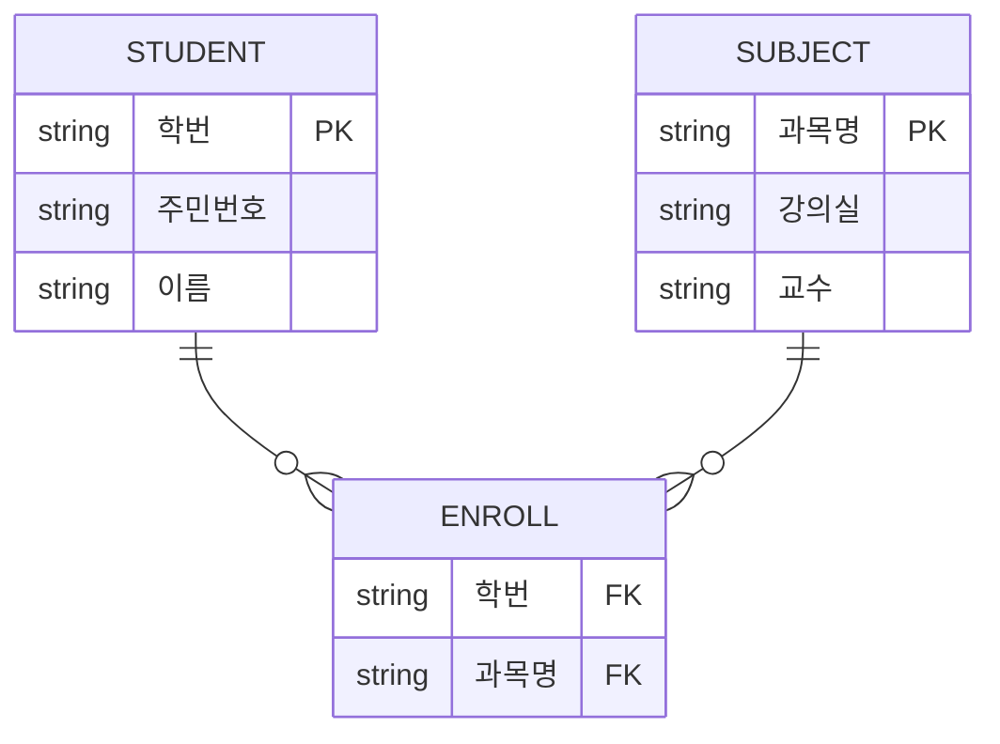

날짜: 2026-05-18
태그: [SQLD, 데이터모델링, 교차엔터티, M:N, ERD, 1과목]
주제: 교차 엔터티로 M:N 분해, 관계 체크사항 4가지
중요도: 상
---

# 교차 엔터티와 관계 체크사항

## 핵심 요약

**교차 엔터티(Intersection Entity)** 는 **M:N 관계**를 표현하기 위해 만든다. **관계형 DB는 M:N을 직접 표현할 수 없으므로**, 교차 엔터티를 두고 **1:N 관계 두 개**로 나눈다. 학생—과목 M:N은 **수강** 교차 엔터티(학번, 과목명)로 **학생 1—N 수강 N—1 과목**으로 변환한다. 관계를 설정할 때는 **연관규칙·정보 조합·규칙 서술·동사** 네 가지를 점검한다.

## 왜 중요한가

- SQLD ERD·논리 설계에서 M:N → 테이블 변환의 **표준 패턴**이다.
- 「관계형 DB에서 M:N 표현 불가」는 단답·O/X 빈출이다.
- 관계 체크사항은 ERD 작성·검토 절차 문제로 연결된다.

> M:N·선택 표기: [06_도메인과_관계](./06_도메인과_관계.md)

---

## 1. 교차 엔터티란

| 항목 | 내용 |
|------|------|
| **정의** | **M:N 관계**를 표현하기 위해 **새로 만든** 엔터티 |
| **이유** | **관계형 DB**는 **M:N 관계를 직접 표현할 수 없음** |
| **다른 이름** | 교차 엔터티, **연관 엔터티**, junction/associative entity |
| **역할** | 양쪽 엔터티의 PK(또는 식별자)를 **FK로 포함**, 필요 시 추가 속성(학점 등) |

---

## 2. M:N → 교차 엔터티로 분해

### Before: 학생 M:N 과목

| 엔터티 | 속성 |
|--------|------|
| 학생 | 학번, 주민번호, 이름 |
| 과목 | 과목명, 강의실, 교수 |

- 관계: **M : N** (양쪽 선택·다수 — IE 표기: 양 끝 원 + 까마귀발)

### After: 학생 — 수강 — 과목

| 엔터티 | 역할 | 속성 |
|--------|------|------|
| 학생 | 기본 | 학번, 주민번호, 이름 |
| **수강** | **교차 엔터티** | **학번**, **과목명** (+ 학점 등 부가 속성 가능) |
| 과목 | 기본 | 과목명, 강의실, 교수 |

| 관계 | 차수 | 표기(예시) |
|------|------|------------|
| 학생 — 수강 | **1 : N** | 학생 쪽 **1(필수)**, 수강 쪽 **0..N(선택)** |
| 과목 — 수강 | **1 : N** | 과목 쪽 **1(필수)**, 수강 쪽 **0..N(선택)** |

### 논리 모델로 읽기

- **수강** 테이블: `(학번, 과목명)` → **복합 기본키** 후보
- 학번 → **학생** FK, 과목명 → **과목** FK
- M:N 한 줄을 **두 개의 1:N** + **중간 테이블**로 구현

---

## 3. 교차 엔터티 vs 사건 엔터티

| 구분 | 교차 엔터티 | 사건 엔터티 (유무형 분류) |
|------|-------------|---------------------------|
| 목적 | **M:N 해소** | **시점의 업무·이벤트** 표현 |
| 예 | **수강** (학생·과목 연결) | 수강, 주문, 예약 |
| 겹침 | 실무에서 **수강**이 두 역할을 동시에 수행하는 경우 많음 | [04](./04_엔터티_분류_유무형과_발생시점.md) 참고 |

---

## 4. 관계 체크사항 (4가지)

엔터티 두 개 사이에 관계를 둘 때 확인한다.

| # | 체크 질문 | 의미 |
|---|-----------|------|
| 1 | **연관규칙**이 있는가? | 두 엔터티 사이에 **업무적으로 의미 있는** 연관 규칙이 존재하는가 |
| 2 | **정보의 조합**이 발생하는가? | 두 엔터티 정보가 **함께 조합**되어 의미를 갖는가 |
| 3 | **규칙이 서술**되어 있는가? | 관계 연결에 대한 **규칙·제약**이 문서/모델에 **서술**되어 있는가 |
| 4 | **동사**가 있는가? | 관계를 가능하게 하는 **동사**(수강한다, 소속된다 등)가 있는가 |

### 예: 학생 — 과목

| 체크 | 적용 |
|------|------|
| 연관규칙 | 학생은 과목을 수강할 수 있다 |
| 정보 조합 | 학번 + 과목명 → 수강 사실 |
| 규칙 서술 | 한 학생이 동일 과목 중복 수강 여부 등 |
| 동사 | **수강한다** |

→ 네 가지가 충족되면 **수강** 교차 엔터티 도입이 타당하다.

---

## 5. 시험 포인트 / 함정

| 구분 | 내용 |
|------|------|
| 관계형 DB | **M:N 직접 표현 불가** → 교차 엔터티·중간 테이블 |
| 분해 결과 | M:N → **1:N + 1:N** |
| FK 위치 | 교차 엔터티(수강)에 **양쪽 PK** |
| 복합키 | 학번 + 과목명 |
| 체크 4항 | 연관규칙 · 정보조합 · 규칙서술 · **동사** |
| 함정 | M:N을 학생 테이블에 과목명만 반복 → **다중값·1NF 위반** |
| 함정 | 교차 엔터티 없이 두 테이블만 FK 2개로 M:N 연결 → **잘못된 관계형 모델** |

---

## 6. 연결 노트

- 이전: [06_도메인과_관계](./06_도메인과_관계.md)
- 다음: [08_식별자_정의와_분류](./08_식별자_정의와_분류.md)
