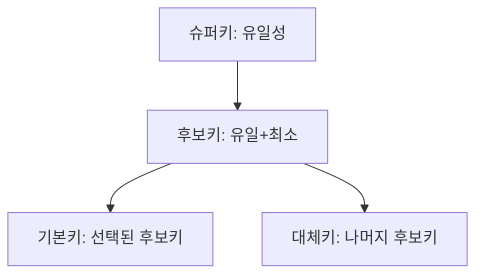

날짜: 2026-05-18
태그: [SQLD, 데이터모델링, 식별관계, 키, 무결성, 1과목]
주제: 식별·비식별 관계, 후보키·슈퍼키·기본키·대체키·외래키, 개체·참조 무결성
중요도: 상
---

# 식별·비식별 관계와 키(Key)

## 핵심 요약

**식별자 관계(강한 연결)** 는 부모 PK가 자식 **PK의 일부**가 되며, **NULL 불가**·**생명주기 동일**(부모 삭제 시 자식도 삭제). **비식별자 관계(약한 연결)** 는 부모 PK가 자식에 **일반 속성(FK)** 으로만 들어가고 PK는 아님·**생명주기 독립**·선택적일 수 있음. IE 표기: **실선=식별**, **점선=비식별**. 논리 단계 **식별자**는 물리 단계 **키**로 구현되며, **후보키**(유일+최소) 중 하나가 **기본키**, 나머지는 **대체키**이다.

## 왜 중요한가

- ERD 실선/점선 해석과 테이블 복합 PK 설계가 1과목 핵심이다.
- 후보키·슈퍼키·대체키 구분은 객관식 빈출이다.
- 개체무결성(PK)·참조무결성(FK)은 2·3과목 SQL과도 연결된다.

> 식별자 분류: [08_식별자_정의와_분류](./08_식별자_정의와_분류.md) · IE/Barker: [02](./02_ERD_표기와_작성순서_ANSI_SPARC.md)

---

## 1. 식별자 관계 vs 비식별자 관계

| 구분 | 식별자 관계 | 비식별자 관계 |
|------|-------------|----------------|
| 다른 이름 | **강한 연결** | **약한 연결** |
| 부모 PK 상속 | 자식 **PK의 일부** | 자식 **일반 속성(FK)** — PK 아님 |
| NULL | 상속 식별자 **NULL 불가** | FK는 규칙에 따라 NULL 가능 |
| 생명주기 | **동일** — 부모 삭제 시 자식도 삭제 | **독립** — 서로 다른 생명주기 |
| 참여 | 보통 **필수** | **선택**인 경우 많음 |
| IE 표기 | 관계선 **실선** | 관계선 **점선** |
| Barker | **\|** (막대) 등으로 구분 | 표기 규칙으로 구분 |

### E-R 예 1: 식별자 관계 — 학생 · 수강

| 엔터티 | 키·속성 구분 |
|--------|----------------|
| **학생** | PK: **학번** |
| **수강** | PK: **학번(FK)** + **과목명** (부모 PK가 PK 영역 **위**=식별) |
| | 일반: 학점 |

→ 수강 행은 **학번 없이 존재할 수 없음** — 강한 종속

### E-R 예 2: 비식별자 관계 — 학생 · 수강신청

| 엔터티 | 키·속성 구분 |
|--------|----------------|
| **학생** | PK: **학번** |
| **수강신청** | PK: **수강신청번호** (인조 식별자) |
| | 일반(FK): **학번(FK)** — PK 영역 **아래** |

→ 수강신청은 자체 번호로 식별, 학생과 **약한 연결**

---

## 2. 키(Key)의 종류

### 테이블 예

**\<학생\>**

| 학번 (PK) | 주민번호 (AK) | 이름 |
|-----------|---------------|------|
| 101 | … | 홍길동 |
| 102 | … | 김철수 |

**\<수강\>**

| 학번 (PK, FK) | 과목명 (PK) | 학점 |
|---------------|-------------|------|
| 101 | DB | 3 |
| 101 | OS | 3 |

- 수강.**학번** → 학생.**학번** 참조 (**외래키**)
- 수강 PK = **(학번, 과목명)** 복합키 → **식별자 관계**의 논리 구현

### 정의

| 키 | 설명 | 조건 |
|----|------|------|
| **슈퍼키** | 튜플을 **유일**하게 식별하는 속성 집합 | **유일성** O, **최소성** 보장 안 함 (여분 속성 가능) |
| **후보키** | 슈퍼키 중 **최소**인 것 | **유일성 + 최소성** |
| **기본키(PK)** | 후보키 중 **대표**로 선택 | **개체무결성** |
| **대체키(AK)** | 후보키 중 PK로 **선택되지 않은** 것 | 유일·최소는 후보키와 동일 |
| **외래키(FK)** | 다른 테이블 **PK를 참조** | **참조무결성** |

### 예로 보는 구분

| 테이블 | 슈퍼키 예 | 후보키 | PK | AK |
|--------|-----------|--------|-----|-----|
| 학생 | {학번, 이름}, {학번} | {학번}, {주민번호} | **학번** | **주민번호** |
| 수강 | {학번, 과목명, 학점} | {학번, 과목명} | **(학번, 과목명)** | (없거나 업무에 따라) |

---

## 3. 무결성

| 무결성 | 적용 | 규칙 |
|--------|------|------|
| **개체무결성** | **기본키** | **NULL 불가**, **중복 불가** |
| **참조무결성** | **외래키** | 참조 대상 PK에 **존재하는 값**이거나, 허용 시 **NULL** |

---

## 4. 식별자(논리) vs 키(물리)

| 단계 | 용어 | 비고 |
|------|------|------|
| **논리적 모델링** | **식별자** (주식별자, 보조식별자, 외부식별자…) | ERD·개념·논리 설계 |
| **물리적 모델링** | **키** (PK, FK, AK…) | DBMS 테이블·제약 구현 |

→ 같은 개념이 **모델링 단계**에 따라 이름만 바뀐다.

---

## 5. 관계 유형 ↔ 키 설계

| ERD | 수강/수강신청 예 | 테이블 결과 |
|-----|------------------|-------------|
| **식별자 관계** | 학생 — 수강 | 수강 PK에 **학번 포함** |
| **비식별자 관계** | 학생 — 수강신청 | 수강신청 PK는 **수강신청번호**, 학번은 **FK만** |

---

## 6. 시험 포인트 / 함정

| 구분 | 내용 |
|------|------|
| 식별 관계 | 부모 PK → 자식 **PK 일부**, 실선, 강한 연결, NULL X |
| 비식별 관계 | 부모 PK → 자식 **FK(일반)**, 점선, 약한 연결, 생명주기 독립 |
| IE 표기 | **실선/점선** — Barker는 **\|** 등 별도 규칙 |
| 후보키 | **유일 + 최소** |
| 슈퍼키 | 유일 O, **최소 X** 가능 |
| AK | **선택받지 못한 후보키** |
| 무결성 | PK → **개체**, FK → **참조** |
| 함정 | FK를 PK에 넣으면 **식별** — 넣지 않으면 **비식별** |
| 함정 | 식별자(논리)와 키(물리)를 **다른 개념**으로 묻기 → **단계별 용어** |

---

## 7. 연결 노트

- 이전: [08_식별자_정의와_분류](./08_식별자_정의와_분류.md)
- 다음: [10_정규화_이상현상과_함수적_종속](./10_정규화_이상현상과_함수적_종속.md)
