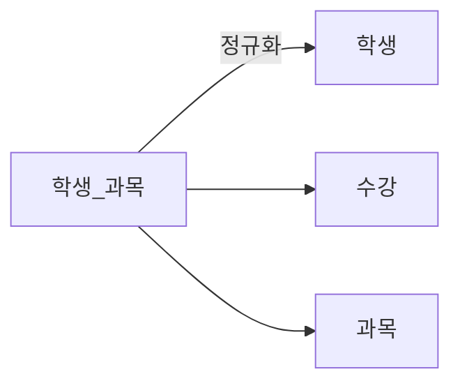

날짜: 2026-05-18
태그: [SQLD, 정규화, 이상현상, 함수적종속, 1과목]
주제: 정규화 정의, 삽입·삭제·갱신 이상, 완전·부분 함수적 종속
중요도: 상
---

# 정규화 — 이상현상과 함수적 종속

> 교재 장 제목: 「2. 데이터 모델과 SQL — 정규화」. SQLD **1과목(데이터 모델링)** · 논리 설계 범위.

## 핵심 요약

**정규화**는 **데이터 중복을 최소화**하기 위해 테이블을 분리하는 방법이며, **이상현상**을 방지한다. **엔터티 = 테이블 = 릴레이션**. 이상현상은 **삽입·삭제·갱신** 세 가지이다. **함수적 종속** \(A \rightarrow B\)에서 A는 **결정자**, B는 **종속자**이며, 복합 PK에 대해 **전체 PK에만** 종속하면 **완전**, **일부 PK**에만 종속하면 **부분** 함수적 종속이다.

## 왜 중요한가

- 1NF~3NF·BCNF 문제의 **전제 개념**이다.
- 이상현상 예시(휴학생·교수명·마지막 수강 행 삭제)는 **지문형**으로 자주 나온다.
- 부분 종속 → **2NF**, 이행 종속 → **3NF**로 이어진다.

> 함수적 종속 기초: [05_속성_정의와_분류](./05_속성_정의와_분류.md)

---

## 1. 정규화란

| 항목 | 내용 |
|------|------|
| **정의** | **데이터 중복을 최소화**하기 위해 **테이블을 분리**하는 방법 |
| **목적** | DB **이상현상** 방지 |
| **용어** | **엔터티 = 테이블 = 릴레이션** (논리·물리에서 동일 대상) |

---

## 2. 이상현상 (Anomaly)

| 유형 | 정의 | `<학생_과목>` 예시 |
|------|------|---------------------|
| **삽입 이상** | 삽입 시 **의도하지 않은 값**까지 넣어야 함 | **휴학생(105)** 만 등록하려 해도 과목·교수 NULL 등 **불완전 행** 필요 |
| **삭제 이상** | 삭제 시 **의도하지 않은 정보**까지 사라짐 | **장보고** 경제 수강 행만 지워도, 그 과목의 **교수(박OO) 정보**가 함께 없어질 수 있음 |
| **갱신 이상** | 일부만 수정해 **모순** 발생 | **김OO** 교수명을 한 행만 바꾸면 같은 과목·다른 행과 **불일치** |

### 비정규 테이블 예

**\<학생_과목\>** — (학번, 이름, 과목명, 교수명)

| 학번 | 이름 | 과목명 | 교수명 |
|------|------|--------|--------|
| 101 | 홍길동 | 수학 | 김OO |
| … | … | … | … |
| 104 | 장보고 | 경제 | 박OO |
| 105 | 휴학생 | NULL | NULL |

### 정규화 결과 (분해)



| 테이블 | 속성 |
|--------|------|
| **\<학생\>** | 학번, 이름 |
| **\<수강\>** | 학번, 과목명 |
| **\<과목\>** | 과목명, 교수명 |

→ 이름은 **학생**에, 교수명은 **과목**에만 두어 **중복·이상**을 줄인다.

---

## 3. 함수적 종속 (Functional Dependency)

### 정의

| 용어 | 의미 |
|------|------|
| **\(A \rightarrow B\)** | 속성 **A**가 정해지면 **B**가 **유일하게** 결정 |
| **결정자** | A (왼쪽) |
| **종속자** | B (오른쪽) |

### 종류 (복합 PK 기준)

| 유형 | 조건 | 예 (`<수강>`) |
|------|------|----------------|
| **완전 함수적 종속** | 종속자가 **PK 전체**에 종속 | **(학번, 과목명) → 시험점수** |
| **부분 함수적 종속** | 종속자가 **PK의 일부**에만 종속 | **과목명 → 교수** (학번은 불필요) |

### \<수강\> 테이블 예

PK: **(학번, 과목명)**

| 학번 | 과목명 | 교수 | 시험점수 |
|------|--------|------|----------|
| 101 | DB | 김교수 | 90 |
| 102 | DB | 김교수 | 85 |

```
과목명 ──→ 교수          (부분 함수적 종속)
(학번, 과목명) ──→ 시험점수   (완전 함수적 종속)
```

→ **부분 종속**이 있으면 **2NF** 미만 — 과목명·교수는 **\<과목\>** 테이블로 분리하는 방향

---

## 4. 정규화와 종속·이상의 연결

| 개념 | 다음 단계 (예정) |
|------|------------------|
| 원자성·다중값 | **1NF** |
| **부분** 함수적 종속 제거 | **2NF** |
| **이행** 함수적 종속 제거 | **3NF** |
| 이상현상 | 비정규 테이블 → **분해** |

---

## 5. 시험 포인트 / 함정

| 구분 | 내용 |
|------|------|
| 정규화 목적 | 중복 **최소화** + **이상현상** 방지 |
| 용어 | 엔터티 = 테이블 = 릴레이션 |
| 이상 3종 | **삽입 · 삭제 · 갱신** |
| 완전 vs 부분 | **PK 전체** vs **PK 일부**에 대한 종속 |
| 부분 종속 예 | 과목명 → 교수 (학번 불필요) |
| 완전 종속 예 | (학번, 과목명) → 시험점수 |
| 함정 | 「중복을 늘려 성능을 높인다」→ 정규화 목적과 **반대** (반정규화는 별도 주제) |
| 함정 | 결정자·종속자 **방향** 뒤바뀜 |

---

## 6. 연결 노트

- 이전: [09_식별_비식별_관계와_키](./09_식별_비식별_관계와_키.md)
- 다음: [11_정규화_단계_1NF부터_5NF](./11_정규화_단계_1NF부터_5NF.md)
