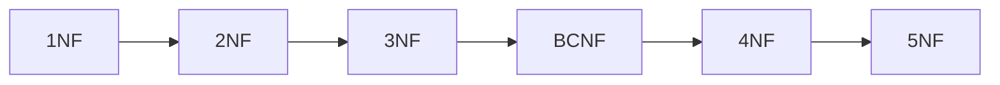
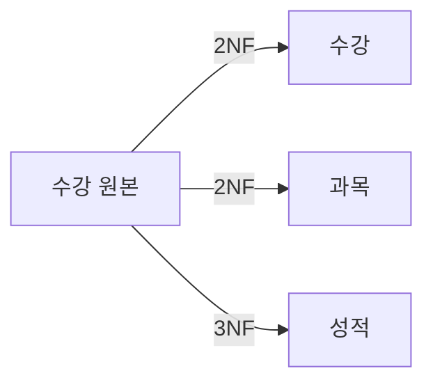

날짜: 2026-05-18
태그: [SQLD, 정규화, 1NF, 2NF, 3NF, BCNF, 1과목]
주제: 정규화 단계(1NF~5NF), 수강 테이블 분해 예, 분해 규칙
중요도: 상
---

# 정규화 단계 — 1NF부터 5NF

## 핵심 요약

정규화 순서: **1NF → 2NF → 3NF → BCNF → 4NF → 5NF**. **1NF**는 **원자값**, **2NF**는 **부분 함수적 종속 제거**, **3NF**는 **이행 함수적 종속 제거**, **BCNF**는 **결정자=후보키**, **4NF**는 **다치 종속 제거**, **5NF**는 **조인 종속** 활용. 암기: **도부이걸다조**(도메인·부분·이행·결정자·다치·조인). 테이블 분해 시 **결정자는 남기고 종속자만 제거**한다.

## 왜 중요한가

- SQLD에서는 **1NF~3NF·BCNF**까지가 핵심이고, **4NF·5NF**는 개념 수준으로 자주 나온다.
- 수강 테이블 분해 예는 **부분·이행 종속** 판별 실전 문제와 동일하다.

> 이상현상·함수적 종속: [10_정규화_이상현상과_함수적_종속](./10_정규화_이상현상과_함수적_종속.md)

---

## 1. 정규화 단계 개요



| 단계 | 요구 사항 | 제거·만족 대상 |
|------|-----------|----------------|
| **1NF** | **도메인**이 **원자값**만으로 구성 | 다중값·복합값 셀 |
| **2NF** | **부분 함수적 종속** 제거 → **완전 함수적 종속** | PK **일부**에만 매달린 종속 |
| **3NF** | **이행 함수적 종속** 제거 | PK가 아닌 속성을 통한 간접 종속 |
| **BCNF** | **결정자**가 모두 **후보키**가 되도록 분해 | 후보키가 아닌 **결정자** |
| **4NF** | **다치 종속** 제거 | 한 속성에 **독립적 다중값** |
| **5NF** | **조인 종속** 이용 | 분해된 테이블을 **무손실 조인**으로 복원 |

### 암기: 도부이걸다조

| 글자 | 키워드 | 단계 |
|------|--------|------|
| **도** | **도**메인 원자값 | 1NF |
| **부** | **부**분 함수적 종속 | 2NF |
| **이** | **이**행 함수적 종속 | 3NF |
| **결** | **결**정자 = 후보키 | BCNF |
| **다** | **다**치 종속 | 4NF |
| **조** | **조**인 종속 | 5NF |

> 구어 암기: **「두부이거다줘」** → **도부이걸다조**

### 시험 범위 참고

- **1NF ~ 3NF(·BCNF)** : 계산·지문형 **빈출**
- **4NF, 5NF** : 정의·개념 위주로 가끔 출제

---

## 2. 1NF — 원자값

| 항목 | 내용 |
|------|------|
| 조건 | 모든 속성의 도메인이 **원자값(Atomic)** |
| 위반 예 | 한 셀에 `수학, 과학` |
| 조치 | 행을 나누어 `수학` / `과학` 각각 한 행 |

```
Before:  A | 수학, 과학
After:   A | 수학
         A | 과학
```

---

## 3. 분해 예 — \<수강\> 테이블 (2NF · 3NF)

### Before (비정규)

PK: **(학번, 과목명)**

| 학번 | 과목명 | 교수 | 시험점수 | 학점 |
|------|--------|------|----------|------|
| … | … | … | … | … |

| 종속 | 유형 | 문제 단계 |
|------|------|-----------|
| **과목명 → 교수** | **부분** (PK 일부만으로 결정) | **2NF** 위반 |
| **(학번, 과목명) → 시험점수** | 완전 | — |
| **시험점수 → 학점** | PK → 시험점수 → 학점 **이행** | **3NF** 위반 |

```
과목명 ──────────→ 교수           (부분 종속 → 2NF)
(학번, 과목명) ──→ 시험점수
시험점수 ────────→ 학점           (이행 종속 → 3NF)
```

### After (3NF까지 분해)

| 테이블 | 속성 | 해결 |
|--------|------|------|
| **\<수강\>** | 학번, 과목명, **시험점수** | PK에 **완전 종속**만 유지 |
| **\<과목\>** | 과목명, **교수** | **부분 종속** 제거 |
| **\<성적\>** | 시험점수, **학점** | **이행 종속** 제거 |



### 분해 규칙 (중요)

> **테이블 분해 시, 결정자는 남기고 종속자만 제거**

| 종속 | 결정자(남김) | 종속자(분리) |
|------|--------------|--------------|
| 과목명 → 교수 | 과목명 | 교수 → \<과목\> |
| 시험점수 → 학점 | 시험점수 | 학점 → \<성적\> |

---

## 4. 단계별 체크 질문

| 단계 | 스스로 묻기 |
|------|-------------|
| **1NF** | 셀에 값이 **여러 개** 들어가 있지 않은가? |
| **2NF** | 복합 PK **일부**만으로 결정되는 속성이 있는가? |
| **3NF** | PK가 아닌 속성 **A → B** 로 이어지는 **이행**이 있는가? |
| **BCNF** | **결정자**가 후보키가 **아닌** \(X \rightarrow Y\) 가 있는가? |
| **4NF** | 한 키에 **서로 독립인** 다중값 집합이 있는가? |
| **5NF** | 분해 후 **조인**으로만 원래 의미가 복원되는가? |

---

## 5. 시험 포인트 / 함정

| 구분 | 내용 |
|------|------|
| 순서 | **1→2→3→BCNF→4→5** (건너뛰기 X) |
| 암기 | **도부이걸다조** |
| 2NF | **부분** 종속 제거 — 과목명→교수 |
| 3NF | **이행** 제거 — 시험점수→학점 (PK→시험점수→학점) |
| 분해 | **결정자 유지**, **종속자 분리** |
| BCNF | **모든 결정자 = 후보키** |
| 함정 | 2NF는 「모든 종속 제거」가 아니라 **부분**만 |
| 함정 | 3NF는 **이행** — PK에 직접 종속이 아닌 **간접** 경로 |

---

## 6. 연결 노트

- 이전: [10_정규화_이상현상과_함수적_종속](./10_정규화_이상현상과_함수적_종속.md)
- 다음: [12_관계와_조인_계층_상호배타](./12_관계와_조인_계층_상호배타.md)
