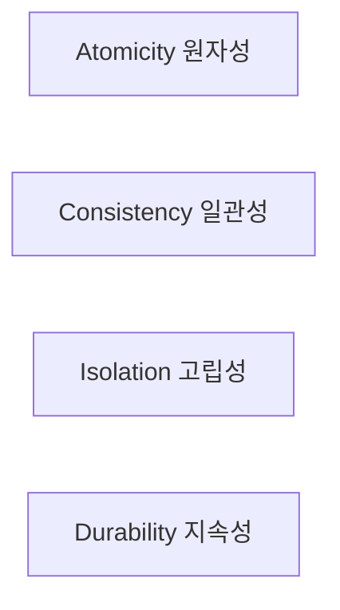
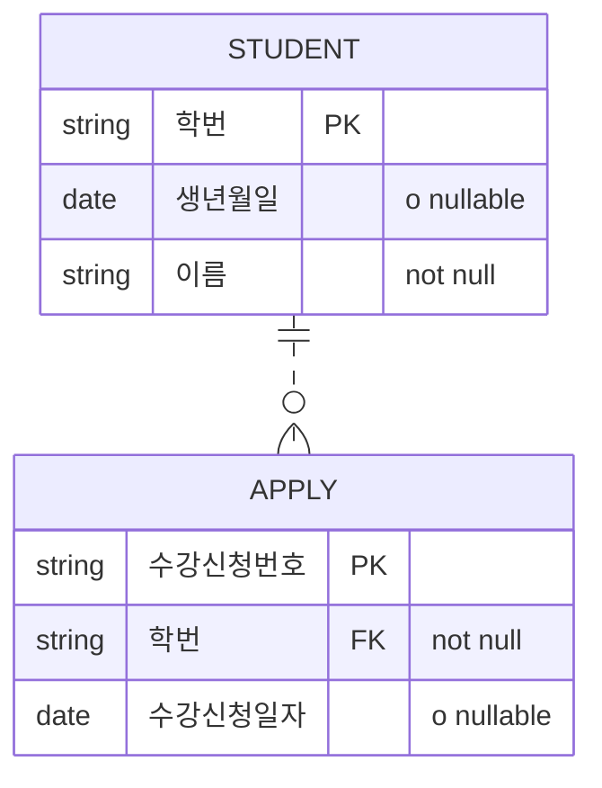

날짜: 2026-05-18
태그: [SQLD, 트랜잭션, ACID, NULL, Barker, 1과목]
주제: 트랜잭션·Commit/Rollback, ACID, 격리 수준 문제, NULL·Barker 표기
중요도: 상
---

# 트랜잭션과 NULL 속성

## 핵심 요약

**트랜잭션**은 DB에서 **하나의 논리적 작업 단위**이며, **Commit**은 정상 종료·저장, **Rollback**은 오류 시 **이전 상태 복구**이다. **ACID** — **원자성·일관성·고립성·지속성**. 격리 수준 문제는 **Dirty Read**, **Non-Repeatable Read**, **Phantom Read**. **NULL**은 미정의 값(0·공백 아님)으로 **비교·연산 불가**, 집계에서 **제외**. **Barker** 표기: **`o`** = NULL 허용, **`*`** = NOT NULL.

## 왜 중요한가

- 1과목에서도 트랜잭션·NULL은 ERD·논리 모델링과 연결되어 출제된다.
- ACID·격리 문제는 2·3과목 SQL·관리와 **공통 기초**이다.
- Barker NULL 표기는 [02](./02_ERD_표기와_작성순서_ANSI_SPARC.md) IE와의 **차이**로 자주 묻는다.

---

## 1. 트랜잭션

### 정의

| 항목 | 내용 |
|------|------|
| **트랜잭션** | 데이터베이스에서 **하나의 논리적 작업 단위** |
| **논리 모델링** | 트랜잭션 요구사항을 **논리 설계 단계**에서 반영해야 함 |

### 제어

| 연산 | 의미 |
|------|------|
| **Commit** | 트랜잭션이 **정상 완료**되었음을 알리고 변경을 **DB에 반영** |
| **Rollback** | 처리 중 **오류** 발생 시 DB를 **이전 상태**로 되돌림 |

---

## 2. ACID — 트랜잭션 4대 특성

| 특성 | 영문 | 의미 |
|------|------|------|
| **원자성** | Atomicity | **전부 수행**되거나 **전혀 수행되지 않음** (All or Nothing) |
| **일관성** | Consistency | 트랜잭션 **전·후** DB가 **일관된 상태** 유지, 오류 없음 |
| **고립성** | Isolation | 실행 중인 트랜잭션끼리 **서로 간섭하지 않음** |
| **지속성** | Durability | **Commit** 후 결과는 **영구 저장** — 장애 후에도 유지 |

> 암기: **원일고지** 또는 영문 **ACID** 순서

---

## 3. 격리 수준에 따른 문제

| 문제 | 설명 |
|------|------|
| **Dirty Read** | **아직 Commit되지 않은** 다른 트랜잭션의 데이터를 **읽음** |
| **Non-Repeatable Read** | 같은 트랜잭션 안에서 **같은 조회를 두 번** 했을 때, 다른 트랜잭션이 **갱신**해 **결과가 달라짐** |
| **Phantom Read** | 같은 조회를 두 번 했을 때, 다른 트랜잭션이 **행을 삽입·삭제**해 **행 수(범위)** 가 달라짐 |

| 구분 | 초점 |
|------|------|
| Non-Repeatable | **이미 읽은 행**의 **값** 변경 |
| Phantom | **조건에 맞는 행 집합**에 **행 추가·삭제** |

---

## 4. NULL 속성

### NULL의 개념

| 항목 | 내용 |
|------|------|
| 의미 | **정의되지 않은 값** |
| 아닌 것 | **0**, **빈 문자열/공백**과 **다름** |
| 비교 | NULL끼리·NULL과 값 **비교 불가** (`= NULL` 대신 `IS NULL`) |
| 연산 | **산술 연산에 사용 불가** |
| 집계 | SUM, AVG 등 **집계 함수에서 제외** |

### NULL 표기 (ERD)

| 표기법 | NULL 허용 표시 |
|--------|----------------|
| **IE** | 속성의 NULL 허용 여부를 **표기하지 않음** |
| **Barker** | **`o`** = NULL **허용** (Optional) |
| | **`*`** = NULL **불가** (Mandatory) |

### Barker E-R 예

**학생**

| 표기 | 속성 | NULL |
|------|------|------|
| `#` | 학번 (PK) | 불가 |
| `o` | 생년월일 | **허용** |
| `*` | 이름 | **불가** — 반드시 입력 |

**수강신청** (학생과 비식별 관계 — 점선)

| 표기 | 속성 | NULL |
|------|------|------|
| `#` | 수강신청번호 (PK) | 불가 |
| `*` | 학번 (FK) | **불가** |
| `o` | 수강신청일자 | **허용** |

> **생년월일·수강신청일자**는 NULL 가능, **이름**은 NULL 불가.

> 관계: [09_식별_비식별_관계와_키](./09_식별_비식별_관계와_키.md) — 학생·수강신청 **비식별(점선)**

---

## 5. 시험 포인트 / 함정

| 구분 | 내용 |
|------|------|
| Commit / Rollback | 성공 **저장** vs 오류 **복구** |
| ACID | **원자·일관·고립·지속** |
| Dirty Read | **미커밋** 데이터 읽기 |
| Non-Repeatable | **동일 행** 재조회 시 **값** 변경 |
| Phantom | 재조회 시 **행 수** 변경 |
| NULL | 0·'' **아님**, 비교·연산·집계 주의 |
| IE vs Barker | IE는 NULL 표기 **없음**, Barker **`o` / `*`** |
| PK | 원칙적으로 **NOT NULL** — 개체무결성 |
| 함정 | NULL = 0 → **오답** |
| 함정 | 집계에 NULL 행 포함 → **제외됨** |

---

## 6. 연결 노트

- 이전: [12_관계와_조인_계층_상호배타](./12_관계와_조인_계층_상호배타.md)
- 다음: [14_본질식별자와_인조식별자](./14_본질식별자와_인조식별자.md)
