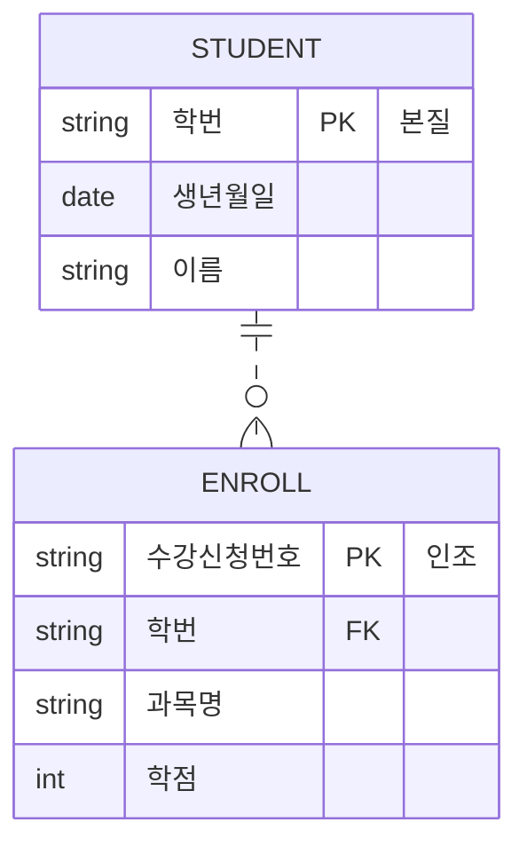

날짜: 2026-05-18
태그: [SQLD, 식별자, 본질식별자, 인조식별자, SurrogateKey, 1과목]
주제: 본질 vs 인조 식별자, E-R 예, 인조식별자 장단점
중요도: 상
---

# 본질식별자 vs 인조식별자

## 핵심 요약

**본질식별자**는 업무·현실에 **원래 존재**하는 식별 수단(학번)이고, **인조식별자**는 시스템이 **인위적으로 부여**한 식별자(Surrogate Key, 수강신청번호)이다. 학생은 본질 PK **학번**, 수강(신청) 엔터티는 인조 PK **수강신청번호** + FK **학번** 구조가 전형적이다. 인조식별자는 **설계·유지보수가 쉬우나**, **중복 가능성**·**불필요한 인덱스** 단점이 있다.

## 왜 중요한가

- PK 설계(자연키 vs 대리키) 선택 문제로 자주 출제된다.
- [08](./08_식별자_정의와_분류.md)의 「본질·인조」 분류를 **장단점**까지 확장한다.
- 비식별 관계(점선)와 **인조 PK** 조합이 실무·시험 ERD에 반복된다.

> 동일 교재에서 M:N 분해용 **수강(학번+과목명)** 과 이름이 겹칠 수 있음 — 맥락(교차 엔터티 vs 신청 단위)으로 구분.

---

## 1. 개념

| 구분 | 정의 | 예 |
|------|------|-----|
| **본질식별자** | **현실 업무**에 존재하는 식별자 | 학번, 과목명, 주민등록번호 |
| **인조식별자** | **인위적으로 생성**한 식별자 (Surrogate Key) | **수강신청번호**, 일련번호, UUID |

→ 업무 키가 복잡·변경·NULL 이슈일 때 **인조식별자**를 PK로 두고, 본질 속성은 **UK(AK)** 로 둘 수 있음

---

## 2. E-R 예 — 학생 · 수강

| 엔터티 | 식별자 유형 | PK·속성 |
|--------|-------------|---------|
| **학생** | **본질식별자** | PK: **학번** / 생년월일, 이름 |
| **수강** | **인조식별자** | PK: **수강신청번호** / 학번(FK), 과목명, 학점 |

| 관계 | 표기 | 의미 |
|------|------|------|
| 학생 — 수강 | **점선**, 1:N | **비식별** — PK에 학번 미포함, FK만 |
| | | 한 학생 · 여러 수강(신청) |

> [09](./09_식별_비식별_관계와_키.md): 수강신청 엔터티명·**비식별(점선)** 과 동일 패턴

---

## 3. 인조식별자의 장단점

### 장점

| # | 내용 |
|---|------|
| 1 | 실제 업무 로직과 **독립**적으로 설계 가능 — 부가 연산이 단순해짐 |
| 2 | **개발·시스템 유지보수**가 용이 (단순 PK, 조인·ORM 매핑) |

### 단점

| # | 내용 |
|---|------|
| 1 | 본질 유일성을 PK로 강제하지 않으면 **데이터 중복** 가능성 |
| 2 | 본질 키 + 인조 키로 **인덱스가 늘어** 성능·저장 부담 |

### 선택 가이드 (요약)

| 상황 | 권장 |
|------|------|
| 업무 키가 **안정·단순·유일** | 본질식별자 PK 검토 |
| 키 **변경·복합·NULL** 이슈, M:N 분해 자식 | **인조식별자** PK + 본질 속성 UK |

---

## 4. 본질 vs 인조 한눈에

| 구분 | 본질식별자 | 인조식별자 |
|------|------------|------------|
| 출처 | **현실·업무** | **시스템** |
| 예 | 학번 | 수강신청번호 |
| PK 적합 | 변경 적고 의미 명확할 때 | 복합·변경·다형 참조 시 |
| 관계 예 | 학생 PK | 수강 PK, 학번은 **FK** |

---

## 5. 시험 포인트 / 함정

| 구분 | 내용 |
|------|------|
| 정의 | 본질 = **업무에 존재** / 인조 = **인위 생성** |
| Surrogate | 인조식별자 = **대리키** |
| ERD | 학생 **학번** vs 수강 **수강신청번호** |
| 장점 | 업무와 **독립 설계**, 유지보수 용이 |
| 단점 | **중복** 가능, **인덱스** 증가 |
| 함정 | 인조 PK만 두고 본질 유일성 **UK 미설정** → 중복 |
| 함정 | 「인조가 항상 나쁘다」→ **상황에 따라** 선택 |

---

## 6. 연결 노트

- 이전: [13_트랜잭션과_NULL](./13_트랜잭션과_NULL.md)
- 관련: [08_식별자_정의와_분류](./08_식별자_정의와_분류.md), [09_식별_비식별_관계와_키](./09_식별_비식별_관계와_키.md)
- 다음: (추가 예정) 반정규화 — 또는 2과목 SQL
