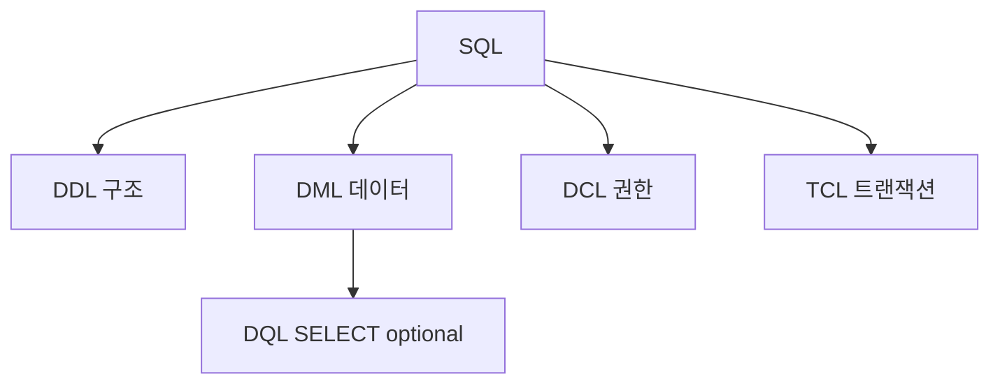

날짜: 2026-05-19
태그: [SQLD, SQL, RDBMS, DDL, DML, 2과목]
주제: DBMS·RDBMS 개요, 테이블 용어, SQL 4분류(DDL·DML·DCL·TCL)
중요도: 상
---

# RDBMS 개요와 SQL 분류

## 핵심 요약

**DBMS**는 DB를 관리·접근하는 환경을 제공하는 시스템이다. **RDBMS**는 데이터를 **테이블**로 저장하고 **테이블 간 관계**로 관리하며, 1970년 **IBM 코드(E.F. Codd)** 가 제안했다. **속성=컬럼=필드**, **튜플=로우=레코드**. **SQL**은 RDBMS용 표준 언어로 **DDL·DML·DCL·TCL** 네 가지로 나뉜다. `SELECT`는 때로 **DQL**로 따로 분류하기도 한다.

## 왜 중요한가

- 2과목 전체의 **출발점** — 문장이 DDL인지 DML인지 구분하는 문제가 많다.
- 1과목에서 배운 **엔터티·릴레이션**이 여기서 **테이블·튜플**로 이어진다.
- `TRUNCATE`·`RENAME` 등 **DDL vs DML** 함정이 빈출이다.

> 1과목 연결: [01_모델링_개념과_단계](../01_데이터_모델링의_이해/01_모델링_개념과_단계.md) — 엔터티 = 테이블 = 릴레이션

---

## 1. DBMS와 RDBMS

| 구분 | 설명 |
|------|------|
| **DBMS** | 데이터베이스를 **관리·접근**할 수 있는 환경을 제공하는 시스템 |
| **RDBMS** | 데이터를 **테이블(표)** 형태로 저장하고, **테이블 간 관계**를 이용해 관리하는 DBMS |

### RDBMS 요약

| 항목 | 내용 |
|------|------|
| 제안 | **1970년**, IBM **E.F. Codd(에드거 코드)** |
| 특징 | 관계(릴레이션) 모델 기반 |
| 대표 제품 | **Oracle**, **SQL Server**, **MySQL**, **PostgreSQL** 등 |

---

## 2. 테이블 용어

### 동의어

| 데이터 모델링 | 테이블 관점 | 영문 |
|---------------|-------------|------|
| **속성** | **컬럼** | Column = **Field** |
| **튜플** | **로우** | Row = **Record** |

### 구성 요소

| 용어 | 설명 |
|------|------|
| **컬럼 헤더** | 열 이름이 적힌 **첫 행** (학번, 주민번호, 이름) |
| **튜플(행)** | 한 인스턴스에 해당하는 **데이터 한 줄** |

### 예: \<학생\> 테이블

| 학번 | 주민번호 | 이름 |
|------|----------|------|
| 101 | 990429-XXXXXXX | 홍길동 |
| 102 | 980504-XXXXXXX | 이순신 |
| 103 | 991215-XXXXXXX | 임꺽정 |
| 104 | 980828-XXXXXXX | 장보고 |

- **열**: 학번, 주민번호, 이름 → **속성(컬럼)**
- **행**: 101, 홍길동 … → **튜플(레코드)**

---

## 3. SQL (Structured Query Language)

| 항목 | 내용 |
|------|------|
| 정의 | RDBMS에서 데이터를 **생성·조회·변경·삭제**하기 위한 **표준 언어** |
| 분류 | **DDL, DML, DCL, TCL** (+ α **DQL**) |

### SQL 4분류 한눈에

| 분류 | 영문 | 용도 | 대표 명령 |
|------|------|------|-----------|
| **DDL** | Data **Definition** | **구조** 생성·변경·삭제 | **CREATE**, **ALTER**, **DROP**, **RENAME**, **TRUNCATE** |
| **DML** | Data **Manipulation** | **데이터** 조회·삽입·수정·삭제 | **SELECT**, **INSERT**, **UPDATE**, **DELETE** |
| **DCL** | Data **Control** | **권한** 부여·회수 | **GRANT**, **REVOKE** |
| **TCL** | **Transaction** Control | **트랜잭션** 제어 | **COMMIT**, **ROLLBACK**, **SAVEPOINT** |

### DQL (참고)

- **SELECT**를 **DQL(Data Query Language)** 로 **별도 분류**하는 경우도 있음
- 시험·교재에 따라 **DML에 포함** vs **DQL 분리** — 지문 표현 확인

### DDL vs DML 구분 (시험용)

| 명령 | 분류 | 대상 |
|------|------|------|
| CREATE TABLE | **DDL** | 테이블 **구조** |
| INSERT | **DML** | **행 데이터** |
| TRUNCATE | **DDL** | 테이블 데이터 전체 삭제(구조 유지) — **DML DELETE와 다름** |
| COMMIT | **TCL** | 트랜잭션 확정 |

---

## 4. 1과목 ↔ 2과목 매핑

| 1과목 | 2과목 SQL |
|-------|-----------|
| 엔터티, 속성, 튜플 | 테이블, 컬럼, 로우 |
| PK, FK | PRIMARY KEY, FOREIGN KEY (DDL) |
| 관계, 조인 개념 | SELECT … JOIN |
| 트랜잭션, ACID | TCL — COMMIT, ROLLBACK |
| [13_트랜잭션과_NULL](../01_데이터_모델링의_이해/13_트랜잭션과_NULL.md) | NULL, IS NULL |

---

## 5. 시험 포인트 / 함정

| 구분 | 내용 |
|------|------|
| RDBMS | **코드**, **1970**, **테이블·관계** |
| 용어 | 속성=컬럼=필드 / 튜플=로우=레코드 |
| DDL | CREATE, ALTER, DROP, RENAME, **TRUNCATE** |
| DML | SELECT, INSERT, UPDATE, DELETE |
| DCL | GRANT, REVOKE |
| TCL | COMMIT, ROLLBACK, SAVEPOINT |
| 함정 | **TRUNCATE** = DDL (DELETE = DML) |
| 함정 | SELECT = DML **또는** DQL — **문항 지문** 확인 |
| 함정 | ALTER = **구조** 변경 (데이터만 바꾸는 UPDATE와 구분) |

---

## 6. 연결 노트

- 이전 (1과목): [14_본질식별자와_인조식별자](../01_데이터_모델링의_이해/14_본질식별자와_인조식별자.md)
- 다음: [02_관계대수_연산자](./02_관계대수_연산자.md)
