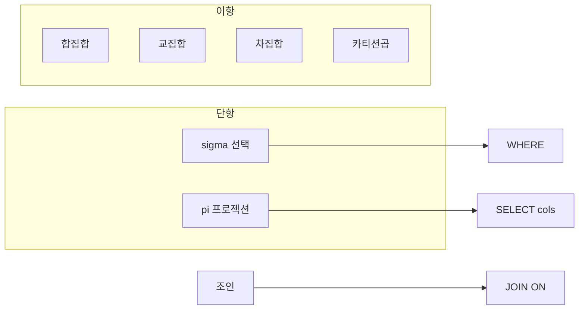

날짜: 2026-05-19
태그: [SQLD, 관계대수, SQL, 2과목]
주제: 관계대수 연산자(σ·π·∪·∩·−·×·⋈)와 SQL 대응
중요도: 상
---

# 관계대수 연산자

## 핵심 요약

**관계대수**는 **SQL의 이론적 기초**가 되는 수학적 언어이다. **단항**: **σ(선택)** 은 조건에 맞는 **튜플(행)** 을, **π(프로젝션)** 은 지정 **속성(열)** 만 추출한다. **이항**: **∪(합집합)**, **∩(교집합)**, **−(차집합)**, **×(카티션 곱)**. **조인 ⋈** 은 공통 속성으로 두 릴레이션을 **병합**한다. 시험에서는 기호 의미와 **대응 SQL**을 함께 묻는다.

## 왜 중요한가

- SELECT·WHERE·JOIN·UNION이 **왜 그렇게 동작하는지** 이해하는 기초이다.
- 1과목 **관계대수(필기)** 와 2과목 SQL이 **같은 축**으로 연결된다.
- σ vs π, × vs ⋈ 구분은 **객관식** 빈출이다.

> SQL 분류: [01_RDBMS와_SQL_개요](./01_RDBMS와_SQL_개요.md)

---

## 1. 관계대수란

| 항목 | 내용 |
|------|------|
| **정의** | 릴레이션(테이블)에 연산을 적용하는 **수학적 언어** |
| **역할** | **SQL의 이론적 기초** |
| **대상** | **튜플(행)** · **속성(열)** · **릴레이션(테이블)** |

---

## 2. 연산자 분류

### 단항 연산자 (Unary)

| 기호 | 이름 | 설명 |
|------|------|------|
| **σ** | **선택 (Selection)** | 특정 **조건**을 만족하는 **튜플(행)** 만 선택 |
| **π** | **프로젝션 (Projection)** | 지정한 **속성(열)** 만 추출 |

### 이항 연산자 (Binary)

| 기호 | 이름 | 설명 |
|------|------|------|
| **∪** | **합집합 (Union)** | 두 릴레이션의 튜플을 **모두** 합침 — **중복 제거** |
| **∩** | **교집합 (Intersect)** | **양쪽 모두**에 존재하는 튜플만 |
| **−** | **차집합 (Difference)** | **첫 번째**에만 있고 **두 번째**에는 없는 튜플 |
| **×** | **카티션 곱 (Cartesian Product)** | 두 릴레이션 튜플의 **모든 조합** |

### 조인 연산자

| 기호 | 이름 | 설명 |
|------|------|------|
| **⋈** | **조인 (Join)** | **공통 속성**을 기준으로 두 릴레이션 **병합** |

> **×(카티션 곱)** 에 **선택 조건 σ** 를 적용한 것이 **⋈(조인)** 과 같다고 보는 관점이 많음.

---

## 3. SQL과의 대응

| 관계대수 | 의미 | SQL (개념) |
|----------|------|------------|
| **σ** | 행 필터 | `WHERE` |
| **π** | 열 선택 | `SELECT` 열 목록 |
| **∪** | 합집합 | `UNION` (중복 제거) / `UNION ALL` |
| **∩** | 교집합 | `INTERSECT` |
| **−** | 차집합 | `EXCEPT` 또는 `MINUS` (DBMS별) |
| **×** | 모든 조합 | `CROSS JOIN` 또는 `FROM A, B` |
| **⋈** | 조건 병합 | `INNER JOIN` … `ON` |

### 예시로 읽기

| 연산 | 관계대수 표현 (개념) | SQL 느낌 |
|------|----------------------|----------|
| 학번=101인 학생 | σ_{학번=101}(학생) | `SELECT * FROM 학생 WHERE 학번 = 101` |
| 이름만 보기 | π_{이름}(학생) | `SELECT 이름 FROM 학생` |
| 학생·수강 연결 | 학생 ⋈ 수강 | `SELECT … FROM 학생 JOIN 수강 ON …` |

---

## 4. σ vs π vs ⋈ (함정 구분)

| 연산 | 대상 | 질문 |
|------|------|------|
| **σ** | **행** (조건) | 「어떤 튜플을 남길까?」 |
| **π** | **열** (속성) | 「어떤 컬럼만 볼까?」 |
| **⋈** | **테이블 2개** | 「어떻게 맞붙일까?」 |
| **×** | **테이블 2개** | 조건 없이 **전부 조합** (행 수 = n × m) |

---

## 5. 시험 포인트 / 함정

| 구분 | 내용 |
|------|------|
| 역할 | 관계대수 = SQL **이론적 기초** |
| σ | **선택** = 조건에 맞는 **행** |
| π | **프로젝션** = **열** 추출 (행 수는 줄일 수 있음, 열은 반드시 줄임) |
| ∪ | 합집합, **중복 제거** (SQL UNION) |
| ∩ | **교집합** |
| − | **차집합** (앞 − 뒤) |
| × | **카티션 곱** — 조건 없는 모든 조합 |
| ⋈ | **조인** — 공통 속성·조건으로 병합 |
| 함정 | σ를 열 선택, π를 행 선택으로 **바꿔 묻기** |
| 함정 | ×와 ⋈ **동일**하다 → ×는 조건 없음, ⋈은 **연결 조건** 있음 |

---

## 6. 연결 노트

- 이전: [01_RDBMS와_SQL_개요](./01_RDBMS와_SQL_개요.md)
- 다음: [03_SELECT_문_구조와_실행순서](./03_SELECT_문_구조와_실행순서.md)
