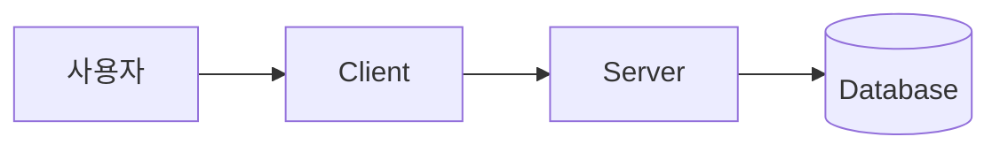

# Mermaid 다이어그램 기초

날짜: 2026-04-02  
태그: [프론트, 도구, 개발방법론, 아키텍처]

## 요약

Mermaid는 텍스트로 다이어그램을 정의하고, 이를 시각화해 문서와 UI에서 구조를 빠르게 공유하는 도구다. 코드 리뷰와 기록 문서에서 "어떻게 연결되는가"를 설명할 때 특히 유용하다.

## 핵심 개념

| 개념 | 설명 |
| --- | --- |
| Mermaid 문법 | `flowchart`, `sequenceDiagram`, `classDiagram` 등 텍스트 DSL |
| 렌더링 방식 | Markdown 코드블록으로 저장 후, 렌더러(예: mermaid 라이브러리)로 SVG 생성 |
| 장점 | 버전 관리가 쉬움, 변경 이력 추적 가능, 문서/코드와 함께 관리 가능 |
| 주의점 | 문법 오류 시 렌더 실패, 큰 다이어그램은 가독성 저하 |

## 상세 설명 (이해한 내용)

### 1) 왜 Mermaid를 쓰는가

- 이미지 편집 툴 없이도 다이어그램을 만들 수 있다.
- 다이어그램 내용이 텍스트이므로 Git diff에서 변경점을 명확히 볼 수 있다.
- 문서형 페이지(`/about`, 패치노트 보조 문서 등)와 궁합이 좋다.

### 2) 기본 문법 예시 (flowchart)

- `LR`: 왼쪽에서 오른쪽 방향(Left to Right)
- `[]`: 일반 노드, `[()]`: 데이터 저장소 형태를 표현할 때 자주 사용
- `-->`: 방향성 있는 연결

### 3) 실무에서 자주 쓰는 유형

- `flowchart`: 페이지/서비스 흐름, 시스템 구성 설명
- `sequenceDiagram`: 요청-응답 순서와 책임 분리 설명
- `stateDiagram`: 상태 전이(예: 로그인, 로딩, 에러 처리) 설명
- `classDiagram`: 타입/모델 관계 설명

### 4) 이 프로젝트 적용 포인트

- `client/public/about.md`에 Mermaid 블록을 작성하면, About 페이지에서 구조를 텍스트+다이어그램으로 함께 전달할 수 있다.
- Markdown 렌더러에서 `language-mermaid` 코드블록만 별도 처리하면 기존 코드블록 동작을 유지하면서 다이어그램을 점진적으로 도입할 수 있다.
- 문서 원본(`about.md`)과 렌더링 로직(`MarkdownWithMath`)을 분리하면 확장과 유지보수가 쉽다.

## 참고

- [Mermaid 공식 문서](https://mermaid.js.org/)
- [about.md](../../client/public/about.md)
- [MarkdownWithMath.tsx](../../client/src/shared/ui/MarkdownWithMath.tsx)
- [MermaidDiagram.tsx](../../client/src/shared/ui/MermaidDiagram.tsx)

